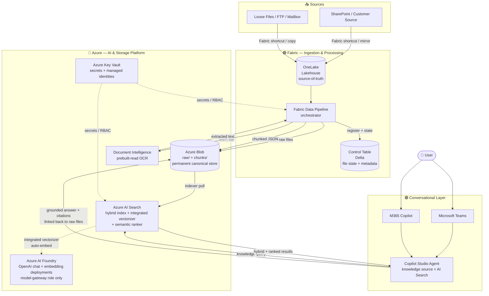

# 01 — Architecture

Reference architecture for the low-code RAG knowledge-base pattern. Read this first, then move to [02-prerequisites.md](./02-prerequisites.md).

---

## Goals

- **Ground a Copilot Studio agent** on a customer document corpus with citation-quality answers
- **Eliminate orchestration code** — every layer is portal-configured or drag-and-drop
- **Reuse customer Fabric investment** for ingestion + staging
- **Make the indexing path production-ready** by reading from Blob (not OneLake DFS Function-wrapper, which is Early Access Preview)
- **Be replicable** across multiple document domains (HR, finance, legal, support, sales enablement) with only configuration changes

## Non-goals

- Structured field extraction into a database (use Document Intelligence custom-extraction + a separate pipeline)
- Multi-agent orchestration, custom tool-calling, query triage logic (defer to a Foundry-based v2)
- Bring-your-own model (non-OpenAI: Cohere, Llama, Phi, Mistral, etc.) — Foundry resource supports the model catalog but the AI Search `azureOpenAI` vectorizer is OpenAI-only; alternate vectorizer kinds (AML-hosted) are out of v1 scope
- Streaming ingestion below ~1-minute latency (Fabric Data Pipelines is batch-oriented; for event-driven, swap in Power Automate)

---

## Architecture diagram



---

## Logical layers

The architecture is intentionally three layers. Each layer has a single responsibility.

### Layer 1 — Ingestion & Processing (Fabric / green)

**Owns:** document acquisition, metadata, OCR orchestration, chunking, write-out to the permanent store.

| Component | Role |
|---|---|
| **OneLake (Lakehouse)** | Source-of-truth landing zone. Receives documents from upstream sources via Fabric shortcuts, mirroring, or direct copy. Authoritative customer-facing data tier. |
| **Control table** (Delta in the Lakehouse) | Tracks every file's processing state. One row per file. Enables idempotent runs, incremental processing, audit trail, and pipeline observability. Schema below. |
| **Fabric Data Pipeline** | Orchestrator. Drag-and-drop activities: lookup new files, register in control table, copy raw to Blob, call Document Intelligence, chunk, write JSON to Blob, mark complete. |

#### Control table schema (reference)

```
control_table_files
├── file_id                STRING   PK (hash of source path + modified ts)
├── source_path            STRING   original SharePoint / OneLake path
├── source_modified_ts     TIMESTAMP  upstream last-modified
├── raw_blob_uri           STRING   blob URI for the copied original
├── chunk_blob_prefix      STRING   blob prefix where chunk JSONs live
├── doc_type               STRING   classification (configurable)
├── byte_size              LONG
├── page_count             INT
├── ingest_run_id          STRING   pipeline run identifier
├── ingest_ts              TIMESTAMP  when this file was first picked up
├── ocr_status             STRING   pending | running | succeeded | failed
├── ocr_completed_ts       TIMESTAMP
├── chunk_status           STRING   pending | running | succeeded | failed
├── chunk_count            INT
├── chunk_completed_ts     TIMESTAMP
├── index_status           STRING   pending | indexing | indexed | failed
├── last_error             STRING   stack / message on failure
└── tombstoned             BOOLEAN  source deletion / archival flag
```

Use Delta merge (`MERGE INTO`) on `file_id` for upserts. Build dashboards on top of this table for observability.

### Layer 2 — AI & Storage Platform (Azure / blue)

**Owns:** all permanent storage, the OCR and embedding services, the search index, and the secrets/identity boundary.

| Component | Role |
|---|---|
| **Azure Key Vault** | Single source of truth for connection strings, API keys, and secrets. Pipelines and indexers authenticate via **managed identity** wherever possible; Key Vault is the fallback for any secret that cannot be replaced by RBAC. |
| **Azure Blob Storage** | Permanent canonical store. Two containers: `raw/` (the original files, used for citation linkback from Copilot Studio answers) and `chunks/` (one JSON file per chunk, consumed by the AI Search indexer). |
| **Azure Document Intelligence** | OCR. Use the **prebuilt-read** model (no training). Returns extracted text, page-aware structure, and confidence scores. |
| **Azure AI Foundry resource** (model gateway) | Two OpenAI deployments hosted in a single Foundry resource: an **embedding** model (recommended: `text-embedding-3-large`) for the AI Search integrated vectorizer, and a **chat completion** model (recommended: `gpt-4o`) for the Copilot Studio generative answers. Foundry resource (kind `AIServices`) supersedes the legacy standalone Azure OpenAI resource for new deployments and exposes an OpenAI-compatible endpoint at `https://<resource>.openai.azure.com/` for backwards-compatible tooling. **This pattern uses Foundry's model-gateway capability only — not its agent runtime (Agent Service / Hub / Projects), which is filled by Copilot Studio in v1.** |
| **Azure AI Search** | The retrieval engine. A single index with text, vector, and metadata fields. **Integrated vectorizer** (`azureOpenAI` kind, pointed at the Foundry resource's OpenAI-compatible endpoint) embeds chunks at index time and embeds user queries at search time — **zero custom embedding code anywhere**. **Hybrid query mode** (BM25 + vector) plus **semantic ranker** on top. **Standard (S1) tier or higher** required. |

#### AI Search index schema (reference)

```
index: documents-rag
├── id                STRING   key, retrievable
├── doc_id            STRING   filterable, facetable (parent file ID)
├── chunk_id          INT      retrievable (chunk ordinal within doc)
├── content           STRING   searchable (BM25 target)
├── content_vector    Collection(Single)  vector field, dim = embedding model output
├── doc_type          STRING   filterable, facetable (domain-specific tag)
├── source_uri        STRING   retrievable (blob URI of raw file, for citation linkback)
├── page_start        INT      retrievable
├── page_end          INT      retrievable
├── ingest_ts         DATETIMEOFFSET  filterable, sortable
└── metadata          STRING   retrievable (JSON blob for extensibility)

vectorizer: azureOpenAI
  → embedding deployment, managed-identity auth, dim matches content_vector

semantic configuration: default
  → title field: doc_id
  → content fields: content
  → keyword fields: doc_type
```

Enable both `semantic` and `vector` configurations on the index. Copilot Studio's AI Search knowledge source will pick them up automatically when "semantic search" is toggled on in the configuration UI.

### Layer 3 — Conversational Layer (Copilot Studio / purple)

**Owns:** the user-facing chat experience and the retrieval-grounding call.

| Component | Role |
|---|---|
| **Copilot Studio Agent** | The agent definition. Configured with **AI Search as a knowledge source** (native connector — point at the index and select "Use semantic search"). Defines the persona, behavior, topic flow, and answer generation behavior. |
| **Microsoft Teams** | Day-one publishing channel. One click from Copilot Studio. Inherits Teams identity + permissions. |
| **M365 Copilot** | Second channel via the M365 Copilot agent gallery. Surfaces the same agent inside the M365 Copilot host. |

Copilot Studio's native AI Search knowledge source:

1. Embeds the user's query via the same AI Search integrated vectorizer
2. Runs a hybrid query (BM25 + vector) with semantic ranker
3. Returns the top N (default 5) chunks with relevance scores and AI-generated captions
4. Passes them to its grounding prompt along with the system prompt and conversation state
5. Generates the answer with citation linkbacks to `source_uri`

No code touches this path.

---

## End-to-end data flow

### Ingest path (background, scheduled)

1. **New file arrives** in the customer's upstream source (SharePoint, file share, mailbox, etc.)
2. **OneLake shortcut / mirror / copy** makes it visible in the Fabric Lakehouse
3. **Fabric Data Pipeline runs** (on schedule or trigger):
    1. Lookup files in the Lakehouse not yet in the control table → insert with `pending` status
    2. For each pending file:
        1. Copy raw file to Blob `raw/` container
        2. Call Document Intelligence `prebuilt-read` → extract text + page structure
        3. Chunk extracted text (chunking strategy below) → write one JSON file per chunk to Blob `chunks/` container
        4. Update control table: `ocr_status=succeeded`, `chunk_status=succeeded`, `chunk_count=N`
4. **AI Search indexer runs** (on schedule, default every 5 minutes):
    1. Polls Blob `chunks/` container for new JSON files
    2. For each new chunk, calls the integrated vectorizer → embeds the `content` field via the Foundry-hosted OpenAI embedding deployment → writes to `content_vector`
    3. Indexes all fields into the index
5. **Indexer marks the chunks indexed**; pipeline (next run) updates control table `index_status=indexed`

### Retrieval path (real-time, per user turn)

1. **User asks a question** in Teams or M365 Copilot
2. **Copilot Studio agent** receives the turn and routes to its AI Search knowledge source
3. **AI Search receives the query**:
    1. Integrated vectorizer embeds the query (same embedding model as at index time)
    2. Hybrid retrieval: BM25 on `content` + vector similarity on `content_vector` → top ~50 candidates
    3. Semantic ranker re-ranks the top candidates with a cross-encoder model → top N (default 5)
    4. Returns chunks with relevance scores, captions, and `source_uri`
4. **Copilot Studio assembles** the grounding prompt with retrieved chunks + system prompt + conversation history → calls the Foundry-hosted OpenAI chat deployment
5. **Agent responds** with the answer + inline citations linking back to `source_uri` (the original raw file in Blob)

### Chunking strategy (reference, configurable)

- **Strategy:** fixed-size with overlap, page-aware
- **Defaults:** ~1,000 tokens per chunk, ~200 token overlap, never split mid-page
- **Why:** balances retrieval recall (smaller chunks = more precise hits) with answer coherence (larger chunks = more context). Page-aware boundaries make citation pointers accurate.
- **Implementation:** Fabric notebook activity within the pipeline using `tiktoken` (or equivalent) for token counting. Output one JSON file per chunk with all fields the index expects.

---

## Trust boundaries & security

### Identity

- **Managed identity everywhere it's supported:**
  - Fabric Data Pipeline → Blob: storage account managed identity
  - Fabric Data Pipeline → Document Intelligence: managed identity
  - Fabric Data Pipeline → Foundry resource: managed identity (where supported in your region; otherwise Key Vault secret)
  - AI Search → Blob: search service managed identity (Storage Blob Data Reader on the chunks/ container)
  - AI Search → Foundry resource: search service managed identity (Cognitive Services OpenAI User on the Foundry resource) — **this is what the integrated vectorizer uses**
  - Copilot Studio → AI Search: API key (Copilot Studio's AI Search knowledge source requires admin or query key today)

### Secrets

- All non-managed-identity credentials live in **Key Vault**
- Copilot Studio's AI Search admin/query key is the most common secret; rotate quarterly minimum

### Network

- For demo: public endpoints are acceptable
- For production: enable **AI Search Private Endpoint**, **Foundry resource Private Endpoint**, **Blob Private Endpoint**, and an **AI Search shared private link** from the search service to the Foundry resource and Blob. Fabric private link is available in supported regions; otherwise allow Fabric egress IP ranges.

### Data residency

- Co-locate **AI Search + Foundry resource + Blob + Document Intelligence** in the same Azure region wherever possible
- Fabric capacity region should match unless cross-region egress is acceptable
- Copilot Studio environment region is independent but should respect customer data-residency policies

---

## Locked decisions — rationale

The README table summarized the locked design. The full rationale for each:

### 1. Copilot Studio native (no Foundry in v1)

Copilot Studio's native AI Search knowledge source delivers retrieval + grounding + citation **without code**. Adding Foundry buys orchestration flexibility (multi-agent routing, custom tool calling, query triage logic) but costs the no-code story. For knowledge-base Q&A — the single most common RAG use case — Copilot Studio native is sufficient. Foundry becomes valuable in **v2** when the agent needs to do more than answer questions (e.g. take actions, call tools, route to specialist sub-agents).

### 2. Integrated vectorizer (Foundry-hosted OpenAI)

Pre-integrated-vectorizer, RAG patterns required custom code to (a) embed chunks at index time and (b) embed user queries at retrieval time. Integrated vectorization makes both invisible: configure the embedding model on the index, and AI Search handles both calls. Removes a class of bugs (embedding-model drift between index and query) and eliminates the need for a custom embedding step in the pipeline.

### 3. Hybrid index (BM25 + vector)

Pure vector search underperforms on exact-match queries: employee IDs, contract numbers, dollar amounts, dates, proper names. Pure BM25 underperforms on semantic similarity ("what's our policy on remote work" vs. literal keyword matches). Hybrid wins both. AI Search's hybrid mode is a single index, single query — no extra cost.

### 4. Semantic ranker ON

The semantic ranker is a Microsoft-trained cross-encoder model that re-ranks the top ~50 results from a hybrid query. Benchmarks consistently show **25–50 % relevance lift** on Q&A workloads. Adds ~300–500 ms latency and ~$1 / 1,000 queries on Standard tier and above. For citation-quality answers — where the difference between "kind of relevant" and "exactly the right paragraph" matters — this is non-negotiable.

### 5. OneLake source / Blob permanent

OneLake is the customer's authoritative data plane and the natural integration point with their broader Fabric ecosystem. **Indexing directly from OneLake** is possible via the OneLake DFS Function-wrapper but is in **Early Access Preview** today — not appropriate for production. Reading from Blob is fully supported, well documented, and cheaper to operate. The two-tier model — OneLake for source, Blob for indexed canonical store — gets the best of both.

### 6. Fabric Data Pipelines orchestrator

Fabric is already in the customer's footprint. Data Pipelines is drag-and-drop, has native activities for OneLake / notebooks / HTTP / Blob / dataflows, and integrates with the Lakehouse Delta table. ADF is too pro-code for a low-code customer. Power Automate is event-driven (better fit if the trigger is SharePoint file-arrived, but harder to schedule + observe at scale).

### 7. Control table in Fabric Lakehouse Delta

Living the control plane inside Fabric (vs. external SQL) keeps governance, RBAC, and observability inside the customer's Fabric workspace. Delta gives atomic upserts, time-travel for audit, and easy Power BI / Dataflow integration for dashboards.

### 8. Document Intelligence prebuilt-read

`prebuilt-read` handles printed + handwritten text, ~70+ languages, and mixed file types (PDF, JPG, PNG, TIFF, BMP, DOCX) with no training required. For RAG over an arbitrary document corpus, no custom extraction is needed — the goal is full text + page structure, which `prebuilt-read` provides.

### 9. Teams + M365 Copilot day-one

Both are native Copilot Studio publishing channels with one-click setup. They cover ~99 % of M365 user surface area with zero additional hosting. Other channels (Web, Direct Line, Slack) are deferred unless the customer has an explicit requirement.

### 10. AI Search Standard (S1) minimum

Semantic ranker requires **Standard tier or higher**. S1 supports ~25 GB storage, ~50 indexes, and provides headroom for production scale. Higher tiers (S2, S3, L1, L2) only become necessary at multi-million-document scale.

---

## Replication / customization points

To adapt this pattern to a new document domain, only these knobs change:

1. **Source attachment** — where OneLake gets its files (SharePoint shortcut, file share copy, mailbox integration, etc.)
2. **Document type taxonomy** — the values in `doc_type` (e.g. for finance: `policy`, `procedure`, `regulation`; for HR: `offer-letter`, `nda`, `severance`)
3. **Chunking parameters** — token size + overlap, tuned to document length and answer style
4. **Index field extensions** — domain-specific filterable metadata (e.g. `effective_date`, `region`, `business_unit`)
5. **Copilot Studio agent persona** — system prompt, topic flow, greeting, fallback behavior
6. **Test corpus + acceptance Q&A** — see [04-testing.md](./04-testing.md) for the evaluation harness

Everything else — pipeline activity wiring, indexer configuration, vectorizer setup, semantic ranker enablement, Copilot Studio knowledge source binding — stays identical.

---

## What's intentionally left out

| Topic | Why | Where to go |
|---|---|---|
| Foundry orchestration | Not needed for knowledge-base Q&A v1 | Defer to a Foundry-based v2 pattern |
| Custom field extraction | Different problem class | Document Intelligence custom-extraction + Fabric / SQL ETL |
| Cross-document reasoning | LLM-side concern, requires larger context or agentic chains | v2 with Foundry agents |
| User-level personalization | Not in scope for shared knowledge base | Layer on top with Copilot Studio user variables + per-user filters |
| Multi-tenancy | Single tenant per agent instance in v1 | Deploy one agent per tenant in v1; revisit for v2 |
| Streaming sub-minute ingestion | Fabric Data Pipelines is batch | Swap to Power Automate event-driven flow |

---

## Versioning

| Version | Date | Change |
|---|---|---|
| v1 | 2026-05-21 | Initial locked reference architecture |

Future versions follow semantic-style numbering: minor for additive changes, major for breaking changes (e.g. Foundry orchestrator v2).

---

*Last updated: 2026-05-21*
