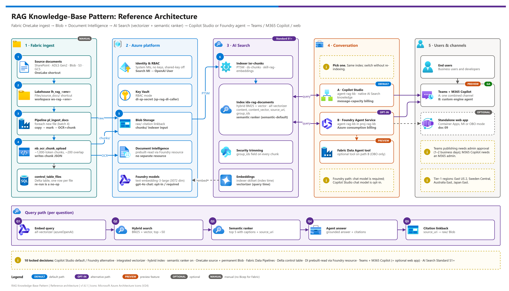
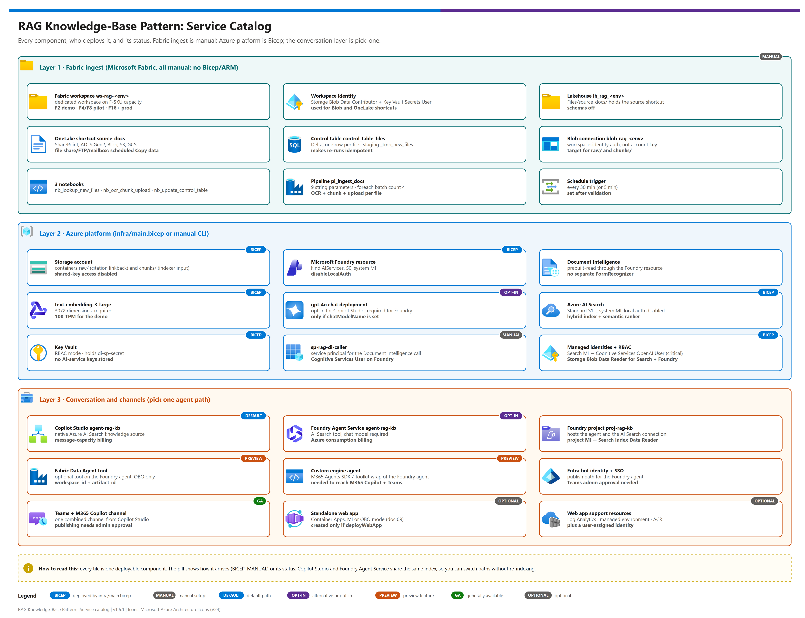

# Document Q&A Knowledge Agent — Reusable RAG Knowledge-Base Pattern

<p>
&nbsp;
&nbsp;
&nbsp;
&nbsp;
&nbsp;
&nbsp;

</p>

    

A reusable, low-code-first **document Q&A agent**: a **Retrieval-Augmented Generation (RAG) knowledge-base** pattern that grounds a conversational agent on a document corpus so users can ask questions and get cited answers. The ingestion and Azure platform layers are shared; the agent itself can be built **two ways — Microsoft Copilot Studio (default) or Microsoft Foundry Agent Service (alternative)**. (**Microsoft Foundry** is the current name for the platform formerly called **Azure AI Foundry**.) This folder is the canonical reference for **demo build + production replication**.

> Formerly published as `fabric-ai-search-copilot-studio`. Old links redirect automatically. Renamed doc pages are mapped in [Moved documents](#moved-documents).

> [!NOTE]
> **Generic on purpose.** This pattern is document-domain agnostic. Use it for HR contracts, finance policies, legal templates, support knowledge bases, product docs, sales enablement libraries, or any unstructured document corpus that needs to power a grounded chat experience.

> [!TIP]
> **Start here:** [docs/00-reproduce-this-demo.md](./docs/00-reproduce-this-demo.md) is the single-page orchestrator. Pick the agent runtime — Copilot Studio  or Foundry Agent Service  — with [Two ways to build the agent](#two-ways-to-build-the-agent-layer-3).

---

## Pattern at a glance

[](./docs/assets/rag-knowledge-base-architecture.png)

<sub>Editable source: [`docs/assets/rag-knowledge-base-architecture.drawio`](./docs/assets/rag-knowledge-base-architecture.drawio) - regenerate with `python scripts/export_diagrams.py docs/assets`.</sub>

---

## Quick start — one command for the Azure layer

| Step | | Action | Gate |
|---|---|---|---|
| **0** |  | `azd auth login --tenant-id <tenant-id>` **and** `az login --tenant <tenant-id>` + `az account set --subscription <subscription-id>` | ☐ `az account show` matches the target |
| **1** |  | `azd env new rag-dev` · `azd env set AZURE_TENANT_ID <tenant-id>` · `azd env set AZURE_SUBSCRIPTION_ID <subscription-id>` · `azd env set AZURE_LOCATION eastus2` | ☐ `azd env get-values` |
| **2** |  | `azd provision --preview`, then `azd up`  | ☐ Hooks pass; `demo-ids.local.json` written; AI Search configured |
| **3** |  | Fabric ingest ([06](./docs/06-fabric-setup.md)), then the agent: Copilot Studio ([07](./docs/07-copilot-studio-setup.md)) or Foundry ([08](./docs/08-foundry-agent-setup.md)) | ☐ Grounded answers with citations |

> [!WARNING]
> azd and az keep **separate** logins and this workspace spans several tenants — the `preprovision` hook stops unless the az context matches `AZURE_TENANT_ID` / `AZURE_SUBSCRIPTION_ID`. Every knob (SKU, models, names, hook behaviour) is in [docs/13-configuration-reference.md](./docs/13-configuration-reference.md); the script path (`infra/deploy.ps1`) and the manual path ([03b](./docs/03b-manual-deployment.md)) deploy the same Bicep.

---

## What's inside

[](./docs/assets/service-catalog.png)

<sub>Editable source: [`docs/assets/service-catalog.drawio`](./docs/assets/service-catalog.drawio) - regenerate with `python scripts/export_diagrams.py docs/assets`.</sub>

| | Service | Role in the pattern |
|---|---|---|
|  | **Microsoft Fabric** (OneLake, Lakehouse, Data Pipelines) | Source / staging, ingestion control table, pipeline orchestration |
|  | **Document Intelligence** `prebuilt-read` | OCR, served by the Microsoft Foundry resource |
|  | **Azure Blob Storage** | Permanent canonical store of chunked text; indexer source |
|  | **Azure AI Search** (S1 default, Basic+) | Hybrid index with integrated vectorization and semantic ranker |
|  | **Microsoft Foundry** (`kind=AIServices`) | Model gateway: embedding deployment, optional chat deployment, Document Intelligence |
|  | **Copilot Studio**  | Default conversational agent, published to Teams + M365 Copilot |
|  | **Foundry Agent Service**  | Alternative agent runtime with AI Search + Fabric Data Agent tools |
|  | **Container Apps**  | Optional self-hosted chat web app |

---

## What this pattern delivers

> [!IMPORTANT]
> Both agent options share the same ingestion and Azure platform layers and read the same AI Search index.


A working end-to-end RAG agent that:

- Ingests an unstructured document corpus from **Fabric OneLake** (or any Fabric-attached source)
- OCRs documents with **Azure Document Intelligence** `prebuilt-read` (served by the same Microsoft Foundry resource as the OpenAI models — no separate FormRecognizer resource is provisioned)
- Chunks text and writes to **Azure Blob Storage** as the permanent canonical store
- Indexes content in **Azure AI Search** using **integrated vectorization** (no custom embedding code) into a **hybrid index** (keyword + vector + metadata)
- Re-ranks results with the **AI Search semantic ranker** for production-grade relevance
- Surfaces answers through a **conversational agent** published to **Microsoft Teams** and **M365 Copilot** — built on **Copilot Studio** (default, lowest-code) **or Microsoft Foundry Agent Service** (alternative). Both agent options share everything above and read the same AI Search index; see [Two ways to build the agent](#two-ways-to-build-the-agent-layer-3) below.

The pattern is intentionally low-code: every step is either a no-code Azure/Fabric portal configuration, a drag-and-drop Fabric Data Pipeline activity, or an agent-configuration screen. **No application code is required for the Copilot Studio path**; the Foundry path adds a Foundry project, a chat deployment and tool wiring, and publishes to Teams / Microsoft 365 Copilot from the Foundry portal (still configuration-first).

---

## Two ways to build the agent (Layer 3)

The ingestion (Fabric) and Azure platform (Blob + AI Search + Foundry model gateway) layers are **identical** for both options — the same `idx-rag-documents` index powers either agent. Pick **one** runtime for the conversational layer; you can switch later without re-indexing.

| | **Copilot Studio**  | **Microsoft Foundry Agent Service**  |
|---|---|---|
| **Best when** | Lowest-code, fully-GA, small audience, or Copilot Studio capacity already licensed | Premium-connector / message-capacity **licensing** is a constraint; you need **structured-data row-level security** (Fabric Data Agent) or **richer orchestration**; you prefer Azure consumption billing |
| **Build doc** | [docs/07-copilot-studio-setup.md](./docs/07-copilot-studio-setup.md) | [docs/08-foundry-agent-setup.md](./docs/08-foundry-agent-setup.md) |
| **Answer model** | Copilot Studio host model (none to deploy) | Your chat deployment, e.g. `gpt-5.5` (required) |
| **Grounding** | AI Search native knowledge source | AI Search **+** a Fabric Data Agent as Foundry **knowledge tools** |
| **Publish to Teams / M365** |  **GA** — one-click combined channel |  **GA** — Foundry portal publish (Azure Bot Service); custom engine agent optional |
| **Preview dependencies** | None | The Microsoft Fabric (data agent) tool  — only when you use it |
| **Billing** | Copilot Studio message capacity | Azure consumption |

**Default to Copilot Studio** for low-code knowledge-base Q&A. **Choose Foundry** when licensing, per-user structured-data security, or multi-tool orchestration require it. Full trade-off analysis + decision matrix: **[docs/10-copilot-studio-vs-foundry.md](./docs/10-copilot-studio-vs-foundry.md)**.

> [!TIP]
> You can switch agent runtimes later without re-indexing — only Layer 3 changes.

---

## Locked design decisions

These are the design decisions locked for this pattern's primary use case — single-purpose knowledge-base Q&A over a document corpus. Deviate only with an explicit decision record describing the deployment-specific need and updated guidance.

| # | Decision | Choice | Why |
|---|---|---|---|
| 1 | Conversational layer (Layer 3) | **Copilot Studio** (default) **or Microsoft Foundry Agent Service** (alternative) — pick one | Copilot Studio's native AI Search knowledge source handles retrieval, grounding, and citation with no code (lowest-code default); Foundry Agent Service is the alternative when licensing, structured-data RLS, or richer orchestration require it — see [Two ways to build the agent](#two-ways-to-build-the-agent-layer-3) and [10](./docs/10-copilot-studio-vs-foundry.md) |
| 2 | Vectorization | **AI Search integrated vectorizer** (Foundry-hosted OpenAI embedding) | Index-time + query-time embedding handled by AI Search; eliminates custom embedding code in the pipeline |
| 3 | Index type | **Hybrid** (BM25 keyword + vector) | Hybrid retrieval consistently beats vector-only on factual / exact-match queries (IDs, dates, names, dollar amounts) |
| 4 | Semantic ranker | **Enabled** | Second-stage re-ranker delivers 25–50 % relevance lift on Q&A workloads; required for production-grade citation quality |
| 5 | Storage split | **OneLake = source / staging, Blob = permanent + indexed** | Reuses your existing Fabric investment for ingestion; Blob is cheaper, easier to secure, and is the simplest source for the AI Search indexer |
| 6 | Pipeline orchestrator | **Fabric Data Pipelines** | Drag-and-drop, native to Fabric, no extra service to license |
| 7 | Ingestion control | **Fabric Lakehouse Delta table** | Tracks file metadata, processing state, and run history for idempotency + incremental processing |
| 8 | OCR | **Document Intelligence prebuilt-read** model, served by the **Microsoft Foundry resource** (`kind=AIServices`) | No model training; handles printed + handwritten text, multiple languages, mixed file types. A Foundry resource is a multi-service Cognitive Services account, so the same resource provisioned for OpenAI deployments also exposes the DI endpoint — no separate `FormRecognizer` resource is needed |
| 9 | Front-end channels | **Teams + M365 Copilot** (+ optional self-hosted web app) | Two native channels with zero additional hosting (demo-ready in minutes); an optional in-repo web app ([12](./docs/12-foundry-agent-webapp.md)) adds a brandable, self-hosted chat UI on Container Apps |
| 10 | AI Search tier | **Standard (S1) default; Basic allowed** | S1 for index-size and vector headroom; Basic is a cost-down demo option (semantic ranker works on Basic and above) |

See [docs/01-architecture.md](./docs/01-architecture.md) for the full design narrative and trust boundaries.

---

## File index

| File | Purpose |
|---|---|
| [README.md](./README.md) | Pattern overview + locked decisions + file index (this file) |
| [docs/00-reproduce-this-demo.md](./docs/00-reproduce-this-demo.md) | **Start here.** Single-page orchestrator with Parts A–F + time budget + end-state diagram |
| [docs/01-architecture.md](./docs/01-architecture.md) | Full reference architecture: diagram, components, data flow, trust boundaries, decisions |
| [docs/02-prerequisites.md](./docs/02-prerequisites.md) | Subscriptions, licensing, RBAC, model availability + regional matrix, quotas, naming conventions |
| [docs/03-deployment.md](./docs/03-deployment.md) |  **Automated path** — `azd up` fast path, then the `infra/deploy.ps1` script path + post-deploy script + ADO pipeline for the **Azure layer**; Fabric still uses 06, the agent uses 07 **or** 08 |
| [docs/03b-manual-deployment.md](./docs/03b-manual-deployment.md) | Manual / portal + CLI walkthrough — **Azure platform layer only** (Phase 1 foundation, Phase 4 AI Search index); best for first-time learning |
| [docs/04-testing.md](./docs/04-testing.md) | Functional tests, retrieval quality, semantic-ranker validation, end-to-end demo script, offline test suite |
| [docs/05-troubleshooting.md](./docs/05-troubleshooting.md) | Common failure modes and fixes, including azd triage |
| [docs/06-fabric-setup.md](./docs/06-fabric-setup.md) | **Fabric setup (always manual)** — workspace, identity, Lakehouse, OneLake shortcut, control table, connections, ingest pipeline. Required after either Azure deployment path. |
| [docs/07-copilot-studio-setup.md](./docs/07-copilot-studio-setup.md) |  **Copilot Studio setup (always manual)** — agent creation, AI Search knowledge source, generative answers, Teams + M365 Copilot publishing. Final step after Azure + Fabric. **One of two Layer-3 options** (see 08). |
| [docs/08-foundry-agent-setup.md](./docs/08-foundry-agent-setup.md) |  **Microsoft Foundry agent setup (alternative to 07)** — builds the agent on the Foundry Agent Service runtime, connecting **AI Search + a Fabric Data Agent** as tools, published to Teams + M365 Copilot from the Foundry portal (GA). Added for licensing-driven deployments (premium-connector / message-capacity constraint). Run **either** 07 **or** 08. |
| [docs/09-fabric-data-agent.md](./docs/09-fabric-data-agent.md) |  **Fabric Data Agent setup (optional — Foundry path)** — load the structured sample tables, then create + ground + publish a **Microsoft Fabric Data Agent** for structured-data Q&A, with the on-behalf-of security model. Consumed by 08 Phase D3. |
| [docs/10-copilot-studio-vs-foundry.md](./docs/10-copilot-studio-vs-foundry.md) | **Decision guide** — Copilot Studio vs. Microsoft Foundry Agent Service for Layer 3: side-by-side, licensing deep-dive, pros/cons, decision matrix, migration note |
| [docs/11-rbac-and-identity-passthrough.md](./docs/11-rbac-and-identity-passthrough.md) | **RBAC & identity reference** — consolidated identity map across all layers, plus how **identity passthrough (OBO)** enforces per-user restrictions: AI Search filter injection vs. Fabric **RLS/OLS/Purview/DLP** and semantic-model security. Config checklist + silent-failure traps. |
| [docs/12-foundry-agent-webapp.md](./docs/12-foundry-agent-webapp.md) |  **Standalone web app front end (optional)** — a self-hosted chat app ([webapp/app/](./webapp/app/)) for the 08 agent on Azure Container Apps, deployed by this repo's own Bicep + script flow, in **MI mode** (default) or **OBO mode** (required for the Fabric data agent tool). A third front-end option alongside Copilot Studio and the Foundry M365/Teams publish. |
| [docs/13-configuration-reference.md](./docs/13-configuration-reference.md) | **Every configurable value** — azd variables, outputs, Bicep + script parameters, `demo-ids.local.json` keys (incl. the `corpus` block), runtime env vars, recipes |
| `azure.yaml` + `infra/azd.bicep` + `infra/azd.parameters.json` + `infra/hooks/` | One-command `azd up` over the shared `main.bicep`: subscription-scoped wrapper, quoted `${VAR=default}` parameters, `preprovision` (name + tenant + soft-delete guards) and `postprovision` (ids file + AI Search config) hooks; `common.ps1` is shared with `deploy.ps1` |
| `infra/main.bicep` + `infra/modules/*.bicep` | Bicep IaC for all Azure resources (RG, KV, Storage, Foundry + model deployments + built-in Document Intelligence, AI Search, RBAC) — plus the **optional** web-app platform (`containerapp.bicep`: Container Apps environment, ACR, Log Analytics, managed identity) gated by the `deployWebApp` parameter |
| `infra/main.parameters.json` | Bicep parameters template — copy to `main.parameters.local.json` for your values (gitignored) |
| `infra/deploy.ps1` | Script path: `az deployment sub create` + merged output capture + post-deploy script; optional `-TenantId` / `-SubscriptionId` guard |
| `scripts/post_deploy_search.py` | Creates AI Search index, data source, skillset and indexer with integrated AOAI vectorization (Bicep can't express these cleanly); reads the `corpus` block |
| `scripts/export_diagrams.py` · `scripts/lint_doc_visuals.py` | Re-export `docs/assets/*.drawio` to PNG (`--check` flags stale PNGs) · visual-richness + link lint for the docs |
| `scripts/deploy-webapp.ps1` | Builds + deploys the optional chat front end (`webapp/app/`) to Container Apps via `az acr build` + `az containerapp`, in MI or OBO identity mode. Runbook: [docs/12](./docs/12-foundry-agent-webapp.md) |
| `scripts/requirements.txt` | Python dependencies for `scripts/` and `tests/` |
| `tests/` + `pytest.ini` | Offline suite (`python -m pytest -q`): payload tests, reusability + retarget guards, configuration-reference guard, doc-visuals lint |
| `.azuredevops/pipelines/deploy-rag-kb.yml` | CI/CD pipeline: Validate → Deploy → Smoke |
| `.gitignore` | Excludes secrets, venvs, populated demo-ids, IDE state from ADO commits |
| `demo-ids.template.json` | Reference template for per-deployment IDs. The live file (`demo-ids.local.json`, gitignored) is **hybrid**: top-level Azure fields are auto-written by `infra/deploy.ps1` or the azd `postprovision` hook from the Bicep `deploymentSummary` and overwritten on every deploy; the **`corpus` block is the single domain-specific surface** (index/skillset names, analyzer, chunking, agent + knowledge-source description — retargeting is a config change, see [docs/01 § Adapting](./docs/01-architecture.md#adapting-this-pattern-to-another-domain)); nested objects (`fabric`, `sp-rag-di-caller`, `copilotStudio`) are populated manually during the Fabric / Copilot Studio setup phases and preserved across deploys (the writer merges rather than overwrites). The template's `_meta` block documents the contract — copy it to `demo-ids.local.json` to scaffold a new environment. Never commit a populated copy. |
| `samples/` | **Structured sample data for the Fabric Data Agent** — `structured/employees.csv` + `agreements.csv` (synthetic HR data) consumed by [09](./docs/09-fabric-data-agent.md). The unstructured document corpus is uploaded separately to trigger ingestion (standalone — not in this repo). See [samples/README.md](./samples/README.md). |
| `webapp/` | **In-repo chat front end (optional)** — a minimal FastAPI app (`app/`) for the 08 agent, deployed by [scripts/deploy-webapp.ps1](./scripts/deploy-webapp.ps1) onto the Container Apps platform. Supports per-user identity passthrough (OBO) for the Fabric data agent tool. Not a fork. Runbook: [docs/12](./docs/12-foundry-agent-webapp.md). |

Read in order on first build. After that, treat them as a reference set.

> [!TIP]
> Chain order: [00](./docs/00-reproduce-this-demo.md) → [01](./docs/01-architecture.md) → [02](./docs/02-prerequisites.md) → [03](./docs/03-deployment.md) (or [03b](./docs/03b-manual-deployment.md)) → [04](./docs/04-testing.md) → [05](./docs/05-troubleshooting.md) → [06](./docs/06-fabric-setup.md) → [07](./docs/07-copilot-studio-setup.md) / [08](./docs/08-foundry-agent-setup.md) → [09](./docs/09-fabric-data-agent.md) → [10](./docs/10-copilot-studio-vs-foundry.md) → [11](./docs/11-rbac-and-identity-passthrough.md) → [12](./docs/12-foundry-agent-webapp.md) → [13](./docs/13-configuration-reference.md). Build order for a first stand-up follows [00](./docs/00-reproduce-this-demo.md) Parts A–F (Azure → Fabric → agent).

---

## Quick-start prerequisites at a glance

You will need (full detail in [docs/02-prerequisites.md](./docs/02-prerequisites.md)):

- **Azure subscription** with Contributor + User Access Administrator on the target resource group
- **Microsoft Fabric tenant** with a workspace you can create artifacts in (Lakehouse + Data Pipelines)
- **Copilot Studio license** for the building user (Maker access) — **for the 07 agent path**. For the **08 Foundry agent path** instead need **Azure AI Developer** (or Project Manager) RBAC on a Foundry project; end users still consume on their **Microsoft 365 Copilot** license on both paths.
- **Microsoft Foundry resource** (a single multi-service Cognitive Services account, `kind=AIServices`) with capacity for **one embedding deployment** (e.g. `text-embedding-3-large`). A chat completion deployment (e.g. `gpt-5.5`) is **opt-in** — the locked design (Copilot Studio + AI Search + integrated vectorizer) does not consume a chat completion model; Copilot Studio uses its own host model for generative answers. The same Foundry resource also exposes **Document Intelligence** (`prebuilt-read` OCR) from its built-in Cognitive Services surface — no separate Document Intelligence / FormRecognizer resource is required. Foundry is the strategic model-gateway resource and supersedes the legacy standalone Azure OpenAI resource for new deployments.
- **Region alignment**: all services (AI Search, Microsoft Foundry — which hosts both the OpenAI models and the Document Intelligence OCR endpoint — Blob, Fabric) ideally in the **same Azure region**, or at least the same data residency boundary
- **AI Search**: **Standard (S1)** by default, **Basic** as a cost-down option (semantic ranker, integrated vectorization and managed identity all work on Basic; Free is excluded because it has no managed identity)
- **Local developer tooling**: **PowerShell 7+ (`pwsh`)**, **Azure CLI 2.60+** (with the `bicep` extension: `az bicep install`), **Python 3.11+**, and `git`. **All shell snippets in this repo are written in PowerShell**, the deployment wrapper is `infra/deploy.ps1`, and the docs assume you're running `pwsh` — see [Shell convention](#shell-convention) below.

> [!WARNING]
> The active `az` account can silently drift across tenants and subscriptions. Before any deployment, verify the tenant and subscription with `az account show` and re-authenticate with `az login --tenant <TENANT_ID>` if they differ — see [docs/03b-manual-deployment.md](./docs/03b-manual-deployment.md) Step 0.

---

## Shell convention

**All shell code blocks in this repo (and in `docs/*.md`) are PowerShell.** They're tagged ```` ```pwsh ```` for syntax highlighting and are designed to be copy-pasteable into a `pwsh` 7+ session on Windows, macOS, or Linux. Conventions used throughout:

| What you'll see | Why |
|---|---|
| `$VAR = "value"` and `$VAR = az ... -o tsv` | PowerShell variable assignment (no `VAR=value` bash form) |
| Backtick `` ` `` at end of line | PowerShell line continuation (no `\` bash form) |
| `curl.exe ...` (not bare `curl`) | Disambiguates from older Windows PowerShell where `curl` was an alias for `Invoke-WebRequest`; `curl.exe` always invokes the real curl binary that ships with Windows 10+ |
| `Invoke-RestMethod \| Select-Object …` | Native PowerShell JSON handling — **no `jq` dependency** required anywhere in the docs |
| `pwsh ./infra/deploy.ps1 ...` | The deployment wrapper. Use `./infra/deploy.ps1 -WhatIf` for a dry run, `-Verify` to run smoke tests, `-RestoreFoundry` to recover from a soft-deleted Foundry account |

If you prefer `bash` for ad-hoc Azure CLI work, the `az` commands themselves are identical — you'd just need to convert `$VAR = "value"` → `VAR=value` and backtick → `\` for line continuation. The Bicep deploys (`az deployment sub create`) and the post-deploy Python script (`scripts/post_deploy_search.py`) are shell-agnostic.

---

## When to use this pattern (and when not to)

> [!NOTE]
> Low-code delivery over an unstructured corpus is the sweet spot; structured extraction and multi-agent routing are out of scope.

### Use this pattern when

- You want a grounded conversational agent over an unstructured document corpus (PDFs, Word docs, scanned files)
- Low-code or no-code delivery is required or strongly preferred
- You already have or are comfortable adopting Microsoft Fabric for ingestion / staging
- The corpus is in the low-thousands to low-hundreds-of-thousands of documents range
- Document content can be addressed by retrieval (Q&A, summarization, citation) — not field extraction into structured records

### Use a different pattern when

- You need **structured field extraction** into a database (e.g. invoice line items, contract clauses into rows) → use a Document Intelligence custom-extraction model + Fabric / SQL pipeline instead
- You need **multi-agent orchestration** with custom triage, routing, or tool-calling logic → add **Microsoft Foundry agent runtime** as an additional orchestration layer above this pattern's components (out of scope for this pattern as written)
- The corpus is in the **millions of documents** with stringent low-latency requirements → revisit index sharding, replica counts, and tier selection beyond Standard
- You require a **non-OpenAI model** (Cohere, Llama, Phi, Mistral, etc.) → Foundry resource supports these via its model catalog, but the AI Search `azureOpenAI` vectorizer is OpenAI-only; non-OpenAI embedding requires the AML-hosted vectorizer kind (out of scope for this pattern as written)

---

## Note on Microsoft Foundry — model gateway, Document Intelligence, and agent runtime

This pattern uses an **Microsoft Foundry resource** (`kind=AIServices`) as the **multi-service Cognitive Services account** that hosts:

- the OpenAI embedding + chat deployments used by the AI Search vectorizer and Copilot Studio, and
- the **Document Intelligence** `prebuilt-read` endpoint used by the Fabric OCR notebook (same resource ID, same managed identity, same RBAC surface — just a different host: `<foundry>.cognitiveservices.azure.com` for DI vs `<foundry>.openai.azure.com` for OpenAI).

It does **not** use Foundry's agent runtime (Agent Service and projects) — that role is filled by Copilot Studio's native AI Search knowledge source. Foundry's capabilities are independent and chosen per deployment need:

| Foundry capability | Recommendation | When to use |
|---|---|---|
| **Model gateway + Document Intelligence** (Microsoft Foundry resource hosting OpenAI + catalog models + the Cognitive Services API surface including DI prebuilt-read) |  **Default for this pattern** | The strategic Azure direction for all new AI model deployments; single multi-service account avoids a separate FormRecognizer resource and a duplicate managed identity; same OpenAI-compatible endpoint as legacy standalone AOAI; flexibility to add non-OpenAI catalog models later under one resource |
| **Agent runtime** (Foundry Agent Service and projects) |  **Add when needed** | Adopt when a deployment need demands it: (a) the agent must do **more than knowledge-base Q&A** — multi-agent routing, custom tool calling, query triage; or (b) **licensing** — Copilot Studio surfaces a premium-connector / message-capacity cost when connecting Azure AI Search **and** a Fabric Data Agent, and moving the runtime to Foundry shifts that to Azure consumption while end users stay on their M365 Copilot license. For pure knowledge-base Q&A with a small audience, Copilot Studio's native AI Search knowledge source delivers retrieval + grounding + citation without code. The Foundry agent path is fully documented in **[docs/08-foundry-agent-setup.md](./docs/08-foundry-agent-setup.md)**; the trade-off analysis is in **[docs/10-copilot-studio-vs-foundry.md](./docs/10-copilot-studio-vs-foundry.md)**. Publishing a Foundry agent to M365/Teams is **GA**; the Microsoft Fabric tool is the remaining **preview** piece. |

---

## Deployment paths

Three entry points over one Bicep template produce the same end-state for the **Azure platform layer**:

| Path | Best for | Doc |
|---|---|---|
| **`azd up`**  — one command, tenant-guarded hooks | Fastest repeatable stand-up; demos; per-engineer environments | [docs/03-deployment.md § Fast path](./docs/03-deployment.md#fast-path--azd-up) |
| **Manual** — portal + CLI walkthrough | Learning the architecture; one-off demo labs; first time with this pattern | [docs/03b-manual-deployment.md](./docs/03b-manual-deployment.md) |
| **Script** — `infra/deploy.ps1` + post-deploy script | Repeated deployments; CI/CD; dev + prod environment parity | [docs/03-deployment.md](./docs/03-deployment.md) |

**Both paths require [docs/06-fabric-setup.md](./docs/06-fabric-setup.md) for the Fabric layer and then a Layer-3 agent build — [docs/07-copilot-studio-setup.md](./docs/07-copilot-studio-setup.md) (Copilot Studio) *or* [docs/08-foundry-agent-setup.md](./docs/08-foundry-agent-setup.md) (Microsoft Foundry Agent Service)**. Pick the agent runtime with [docs/10-copilot-studio-vs-foundry.md](./docs/10-copilot-studio-vs-foundry.md). Fabric and both agent paths are always manual — Fabric workspaces, Lakehouses, OneLake shortcuts, and Data Pipelines have no Bicep/Terraform surface today; Copilot Studio is Power Platform (no IaC); and the Foundry agent + its M365/Teams publish are portal-built. [docs/00-reproduce-this-demo.md](./docs/00-reproduce-this-demo.md) is the orchestrator that walks all three layers (Azure platform → Fabric → agent) through Parts A–F.

---

## Distribution

> [!IMPORTANT]
> Never commit a populated `demo-ids.local.json` or any secret material.

This Demos folder is intended to be **checked into Azure DevOps** as a standalone repo in your tenant (typical: `https://dev.azure.com/<org>/<project>/_git/rag-knowledge-base-pattern`). The included `.gitignore` and `demo-ids.template.json` are scaffolded for that workflow:

- **`.gitignore`** — excludes secrets (`*.pem`, `*.key`, `.sp-secret.json`, `secrets.json`), the populated copy of demo-ids (`demo-ids.local.json`), the azd environment folder (`.azure/` — tenant/subscription IDs and outputs), Python venvs, IDE state, and local deployment artifacts.
- **`demo-ids.template.json`** — reference template for the per-deployment IDs file. The live file (`demo-ids.local.json`, gitignored) is **hybrid**: `infra/deploy.ps1` or the azd `postprovision` hook auto-writes the Azure resource IDs / endpoints / MI object IDs from the Bicep `deploymentSummary` output on every successful deploy, and *merges* (rather than overwrites) — so nested objects you populate manually during the Fabric and Copilot Studio setup phases (`corpus`, `fabric`, `sp-rag-di-caller`, `copilotStudio`) survive subsequent redeploys. The `_meta` block in both files documents the contract. **Never commit a populated `demo-ids.local.json` or any secret material.**
- **Runtime values** (per-environment workspace IDs, endpoints) should come from your CI tool's secret store (ADO variable groups / GitHub Actions secrets / Key Vault), not from the repo.

---

## Moved documents

v1.7.0 (2026-10-07) renumbered the docs to the standard demo layout. If you hold a link to an old path, use the new location below.

| Old path (before v1.7.0) | New location |
|---|---|
| `docs/03-deployment-manual.md` | [docs/03b-manual-deployment.md](./docs/03b-manual-deployment.md) |
| `docs/03b-fabric-setup.md` | [docs/06-fabric-setup.md](./docs/06-fabric-setup.md) |
| `docs/03c-copilot-studio-setup.md` | [docs/07-copilot-studio-setup.md](./docs/07-copilot-studio-setup.md) |
| `docs/03d-foundry-agent-setup.md` | [docs/08-foundry-agent-setup.md](./docs/08-foundry-agent-setup.md) |
| `docs/03e-fabric-data-agent.md` | [docs/09-fabric-data-agent.md](./docs/09-fabric-data-agent.md) |
| `docs/04-deployment-automated.md` | [docs/03-deployment.md](./docs/03-deployment.md) |
| `docs/05-testing.md` | [docs/04-testing.md](./docs/04-testing.md) |
| `docs/06-troubleshooting.md` | [docs/05-troubleshooting.md](./docs/05-troubleshooting.md) |
| `docs/07-copilot-studio-vs-foundry.md` | [docs/10-copilot-studio-vs-foundry.md](./docs/10-copilot-studio-vs-foundry.md) |
| `docs/08-rbac-and-identity-passthrough.md` | [docs/11-rbac-and-identity-passthrough.md](./docs/11-rbac-and-identity-passthrough.md) |
| `docs/09-foundry-agent-webapp.md` | [docs/12-foundry-agent-webapp.md](./docs/12-foundry-agent-webapp.md) |

`docs/00-reproduce-this-demo.md`, `docs/01-architecture.md` and `docs/02-prerequisites.md` kept their paths; `docs/13-configuration-reference.md` is new.

---

## Change history

Change history lives in [CHANGELOG.md](./CHANGELOG.md).

> [!NOTE]
> Current pattern version: v1.7.0.

---

*Last updated: 2026-10-07*
