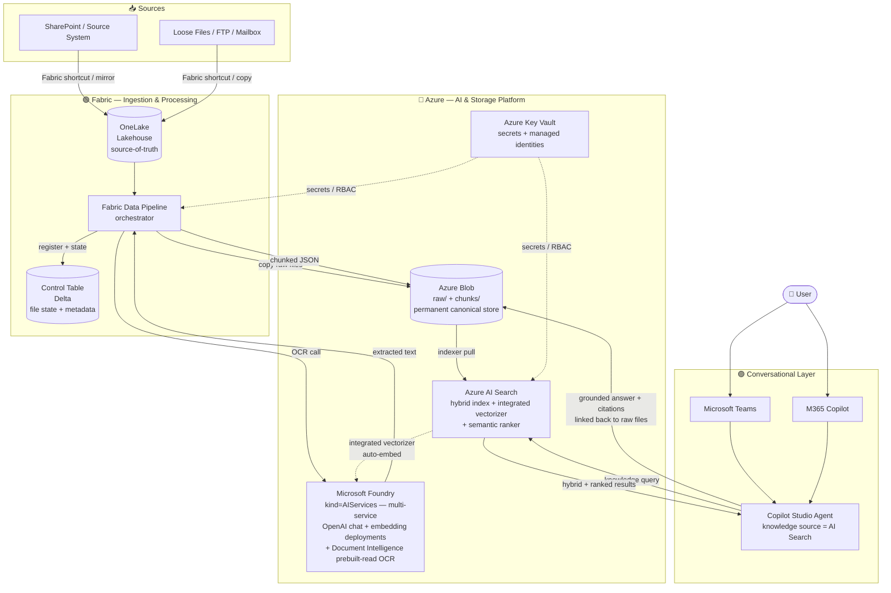

# 01 — Architecture

Reference architecture for the low-code RAG knowledge-base pattern. Read this first, then move to [02-prerequisites.md](./02-prerequisites.md).

---

## Goals

- **Ground a Copilot Studio agent** on a document corpus with citation-quality answers
- **Eliminate orchestration code** — every layer is portal-configured or drag-and-drop
- **Reuse your existing Fabric investment** for ingestion + staging
- **Make the indexing path production-ready** by reading from Blob (not OneLake DFS Function-wrapper, which is Early Access Preview)
- **Be replicable** across multiple document domains (HR, finance, legal, support, sales enablement) with only configuration changes

## Non-goals

- Structured field extraction into a database (use Document Intelligence custom-extraction + a separate pipeline)
- Multi-agent orchestration, custom tool-calling, query triage logic (these require **Foundry agent runtime** as an additional layer above this pattern — out of scope for the knowledge-base Q&A focus here)
- Bring-your-own model (non-OpenAI: Cohere, Llama, Phi, Mistral, etc.) — Foundry resource supports the model catalog but the AI Search `azureOpenAI` vectorizer is OpenAI-only; alternate vectorizer kinds (AML-hosted) are out of scope for this pattern
- Streaming ingestion below ~1-minute latency (Fabric Data Pipelines is batch-oriented; for event-driven, swap in Power Automate)

---

## Architecture diagram



---

## Logical layers

The architecture is intentionally three layers. Each layer has a single responsibility.

### Layer 1 — Ingestion & Processing (Fabric / green)

**Owns:** document acquisition, metadata, OCR orchestration, chunking, write-out to the permanent store.

| Component | Role |
|---|---|
| **OneLake (Lakehouse)** | Source-of-truth landing zone. Receives documents from upstream sources via Fabric shortcuts, mirroring, or direct copy. Authoritative data tier. |
| **Control table** (Delta in the Lakehouse) | Tracks every file's processing state. One row per file. Enables idempotent runs, incremental processing, audit trail, and pipeline observability. Schema below. |
| **Fabric Data Pipeline** | Orchestrator. Drag-and-drop activities: lookup new files, register in control table, copy raw to Blob, call Document Intelligence, chunk, write JSON to Blob, mark complete. |

#### Control table schema (reference)

```
control_table_files
├── file_id                STRING   PK (hash of source path + modified ts)
├── source_path            STRING   original SharePoint / OneLake path
├── source_modified_ts     TIMESTAMP  upstream last-modified
├── raw_blob_uri           STRING   blob URI for the copied original
├── chunk_blob_prefix      STRING   blob prefix where chunk JSONs live
├── doc_type               STRING   classification (configurable)
├── byte_size              LONG
├── page_count             INT
├── ingest_run_id          STRING   pipeline run identifier
├── ingest_ts              TIMESTAMP  when this file was first picked up
├── ocr_status             STRING   pending | running | succeeded | failed
├── ocr_completed_ts       TIMESTAMP
├── chunk_status           STRING   pending | running | succeeded | failed
├── chunk_count            INT
├── chunk_completed_ts     TIMESTAMP
├── index_status           STRING   pending | indexing | indexed | failed
├── last_error             STRING   stack / message on failure
└── tombstoned             BOOLEAN  source deletion / archival flag
```

Use Delta merge (`MERGE INTO`) on `file_id` for upserts. Build dashboards on top of this table for observability.

### Layer 2 — AI & Storage Platform (Azure / blue)

**Owns:** all permanent storage, the OCR and embedding services, the search index, and the secrets/identity boundary.

| Component | Role |
|---|---|
| **Azure Key Vault** | Single source of truth for connection strings, API keys, and secrets. Pipelines and indexers authenticate via **managed identity** wherever possible; Key Vault is the fallback for any secret that cannot be replaced by RBAC. |
| **Azure Blob Storage** | Permanent canonical store. Two containers: `raw/` (the original files, used for citation linkback from Copilot Studio answers) and `chunks/` (one JSON file per chunk, consumed by the AI Search indexer). |
| **Azure Document Intelligence** | OCR. Use the **prebuilt-read** model (no training). Returns extracted text, page-aware structure, and confidence scores. **Served by the same Foundry/AIServices account** — there is no separate `Microsoft.CognitiveServices/accounts` of `kind=FormRecognizer` in this pattern; the DI REST/SDK endpoint is the Foundry resource's `*.cognitiveservices.azure.com` URL. |
| **Microsoft Foundry resource** (model gateway; formerly **Azure AI Foundry**) | Provisioned for the AI Search integrated vectorizer: one **embedding** deployment (recommended: `text-embedding-3-large`) is required. A **chat completion** deployment (e.g. `gpt-4o`) is **opt-in** — the locked design does not consume one because Copilot Studio uses its own host model for generative answers; only deploy a chat model when a deployment explicitly needs a chat endpoint (custom app code, Foundry agent runtime, BYOM Copilot Studio). Foundry resource (kind `AIServices`) supersedes the legacy standalone Azure OpenAI resource for new deployments and exposes an OpenAI-compatible endpoint at `https://<resource>.openai.azure.com/` for backwards-compatible tooling. **This pattern uses Foundry's model-gateway capability only — not its agent runtime (Agent Service and projects), which is filled by Copilot Studio. Foundry agent runtime is a deployment-specific addition for cases that need multi-agent routing, custom tool calling, or query triage beyond knowledge-base Q&A.** |
| **Azure AI Search** | The retrieval engine. A single index with text, vector, and metadata fields. **Integrated vectorizer** (`azureOpenAI` kind, pointed at the Foundry resource's OpenAI-compatible endpoint) embeds chunks at index time and embeds user queries at search time — **zero custom embedding code anywhere**. **Hybrid query mode** (BM25 + vector) plus **semantic ranker** on top. **Standard (S1) tier or higher** required. |

#### AI Search index schema (reference)

```
index: documents-rag
├── id                STRING   key, retrievable
├── doc_id            STRING   filterable, facetable (parent file ID)
├── chunk_id          INT      retrievable (chunk ordinal within doc)
├── content           STRING   searchable (BM25 target)
├── content_vector    Collection(Single)  vector field, dim = embedding model output
├── doc_type          STRING   filterable, facetable (domain-specific tag)
├── source_uri        STRING   retrievable (blob URI of raw file, for citation linkback)
├── page_start        INT      retrievable
├── page_end          INT      retrievable
├── ingest_ts         DATETIMEOFFSET  filterable, sortable
├── group_ids         Collection(STRING)  filterable, retrievable (Entra group IDs allowed to see this chunk — chunk-level security trimming; empty = all authenticated users)
└── metadata          STRING   retrievable (JSON blob for extensibility)

vectorizer: azureOpenAI
  → embedding deployment, managed-identity auth, dim matches content_vector

semantic configuration: default
  → title field: doc_id
  → content fields: content
  → keyword fields: doc_type
```

Enable both `semantic` and `vector` configurations on the index. Copilot Studio's AI Search knowledge source will pick them up automatically when "semantic search" is toggled on in the configuration UI.

### Layer 3 — Conversational Layer (Copilot Studio / purple)

**Owns:** the user-facing chat experience and the retrieval-grounding call.

| Component | Role |
|---|---|
| **Copilot Studio Agent** | The agent definition. Configured with **AI Search as a knowledge source** (native connector — point at the index and select "Use semantic search"). Defines the persona, behavior, topic flow, and answer generation behavior. |
| **Microsoft Teams** | Day-one publishing channel. One click from Copilot Studio. Inherits Teams identity + permissions. |
| **M365 Copilot** | Second channel via the M365 Copilot agent gallery. Surfaces the same agent inside the M365 Copilot host. |

Copilot Studio's native AI Search knowledge source:

1. Embeds the user's query via the same AI Search integrated vectorizer
2. Runs a hybrid query (BM25 + vector) with semantic ranker
3. Returns the top N (default 5) chunks with relevance scores and AI-generated captions
4. Passes them to its grounding prompt along with the system prompt and conversation state
5. Generates the answer with citation linkbacks to `source_uri`

No code touches this path.

### Layer 3 — alternative: Microsoft Foundry Agent Service (licensing-driven)

Layer 3 has **two interchangeable implementations**. The Copilot Studio version above is the default. The **Microsoft Foundry Agent Service** version is the alternative — it grounds on the **same `idx-rag-documents` index** but runs the agent on Foundry and surfaces it in Teams / M365 Copilot as a **custom engine agent** (preview). Layers 1–2 are untouched; only this layer swaps.

| Component | Role |
|---|---|
| **Foundry agent** (`agent-rag-kb`) | The agent definition on the Agent Service runtime. Owns query planning, tool routing, grounding, and citation assembly. Generates answers on **your** chat-model deployment (the chat deployment that is *opt-in* for the Copilot Studio path is **required** here). |
| **Azure AI Search tool** | Grounds the agent on `idx-rag-documents` via a project connection using the **Foundry project managed identity** (granted **Search Index Data Reader**). Same hybrid + semantic + integrated-vectorizer retrieval as the Copilot Studio knowledge source. |
| **Microsoft Fabric tool** (Fabric Data Agent) | Adds **structured-data** Q&A over a published Fabric Data Agent. Uses **on-behalf-of caller identity** so Fabric **row-/object-level security** is enforced per user — the cleanest per-user trimming story for sensitive (e.g. HR) data. |
| **Custom engine agent channel** (Teams + M365 Copilot) | A Microsoft 365 Agents SDK / Toolkit wrapper (Entra bot) forwards user turns to the agent endpoint. **Preview** — re-verify before production. End users consume on their existing M365 Copilot license. |
| **Standalone web app** (optional) | A self-hosted chat UI on Azure Container Apps ([09](09-foundry-agent-webapp.md)) — an alternative front end to the custom engine agent, with per-user **OBO** identity passthrough (required for the Fabric tool). |

**Why pick this layer:** primarily **licensing** — connecting Azure AI Search *and* a Fabric Data Agent in Copilot Studio pulls them in as premium / message-capacity-billed connectors on top of M365 Copilot; the Foundry runtime shifts that to **Azure consumption**. Secondary reasons: richer orchestration (multi-tool routing, agentic actions) and unified Azure RBAC / Private Link. Full build steps in [03d-foundry-agent-setup.md](03d-foundry-agent-setup.md); the decision guide is [07-copilot-studio-vs-foundry.md](07-copilot-studio-vs-foundry.md).

---

## End-to-end data flow

### Ingest path (background, scheduled)

1. **New file arrives** in your upstream source (SharePoint, file share, mailbox, etc.)
2. **OneLake shortcut / mirror / copy** makes it visible in the Fabric Lakehouse
3. **Fabric Data Pipeline runs** (on schedule or trigger):
    1. Lookup files in the Lakehouse not yet in the control table → insert with `pending` status
    2. For each pending file:
        1. Copy raw file to Blob `raw/` container
        2. Call Document Intelligence `prebuilt-read` → extract text + page structure
        3. Chunk extracted text (chunking strategy below) → write one JSON file per chunk to Blob `chunks/` container
        4. Update control table: `ocr_status=succeeded`, `chunk_status=succeeded`, `chunk_count=N`
4. **AI Search indexer runs** (on schedule, default every 5 minutes):
    1. Polls Blob `chunks/` container for new JSON files
    2. For each new chunk, calls the integrated vectorizer → embeds the `content` field via the Foundry-hosted OpenAI embedding deployment → writes to `content_vector`
    3. Indexes all fields into the index
5. **Indexer marks the chunks indexed**; pipeline (next run) updates control table `index_status=indexed`

### Retrieval path (real-time, per user turn)

1. **User asks a question** in Teams or M365 Copilot
2. **Copilot Studio agent** receives the turn and routes to its AI Search knowledge source
3. **AI Search receives the query**:
    1. Integrated vectorizer embeds the query (same embedding model as at index time)
    2. Hybrid retrieval: BM25 on `content` + vector similarity on `content_vector` → top ~50 candidates
    3. Semantic ranker re-ranks the top candidates with a cross-encoder model → top N (default 5)
    4. Returns chunks with relevance scores, captions, and `source_uri`
4. **Copilot Studio assembles** the grounding prompt with retrieved chunks + system prompt + conversation history and runs generative answers against **its own host LLM** (the M365 Copilot model in Teams / M365 Copilot channels). The Foundry-hosted chat deployment is **not on the default call path** — it's only used if the deployment opts in to a custom Azure OpenAI endpoint via Copilot Studio bring-your-own-model or replaces Copilot Studio with a Foundry-agent / custom app code stack.
5. **Agent responds** with the answer + inline citations linking back to `source_uri` (the original raw file in Blob)

### Chunking strategy (reference, configurable)

- **Strategy:** fixed-size with overlap, page-aware
- **Defaults:** ~1,000 tokens per chunk, ~200 token overlap, never split mid-page
- **Why:** balances retrieval recall (smaller chunks = more precise hits) with answer coherence (larger chunks = more context). Page-aware boundaries make citation pointers accurate.
- **Implementation:** Fabric notebook activity within the pipeline using `tiktoken` (or equivalent) for token counting. Output one JSON file per chunk with all fields the index expects.

---

## Trust boundaries & security

> **Consolidated reference:** [08-rbac-and-identity-passthrough.md](08-rbac-and-identity-passthrough.md) maps every identity across all layers and explains how per-user restrictions (RLS/OLS, Purview/DLP, semantic-model security) propagate via identity passthrough.

### Identity

- **Managed identity everywhere it's supported:**
  - Fabric Data Pipeline → Blob: storage account managed identity
  - Fabric Data Pipeline → Document Intelligence: managed identity
  - Fabric Data Pipeline → Foundry resource: managed identity (where supported in your region; otherwise Key Vault secret)
  - AI Search → Blob: search service managed identity (Storage Blob Data Reader on the chunks/ container)
  - AI Search → Foundry resource: search service managed identity (Cognitive Services OpenAI User on the Foundry resource) — **this is what the integrated vectorizer uses**
  - Copilot Studio → AI Search: **Microsoft Entra ID** (admin/query keys are disabled on the search service — see [03c § C0.3](03c-copilot-studio-setup.md)). With **Entra ID Integrated**, the data connection resolves to the **calling user's identity** at runtime, which is the prerequisite for document/chunk-level security trimming. **Service principal** is the production alternative (one stable identity).

### Document-level (chunk-level) access control

Because **each chunk is one index document**, "per-chunk security" *is* document-level access control. Azure AI Search offers four approaches ([overview](https://learn.microsoft.com/azure/search/search-document-level-access-overview)):

| Approach | Status | When to use |
|---|---|---|
| **Security filters** (group/string trimming via a `group_ids` field) | **GA** | Default for this pattern — chunks are *derived* JSON, so source ACLs don't carry over; a push-model `group_ids` field is the reliable mechanism. |
| POSIX ACL / RBAC scopes | Preview (2026-05-01) | Source is ADLS Gen2 / Blob with native ACL/RBAC; token-based query-time enforcement. |
| Purview sensitivity labels | Preview | Strategic for OneLake/Fabric environments — indexer carries MIP labels; enforced via Entra + Purview policy. |
| SharePoint M365 ACLs | Preview | Source is SharePoint M365 libraries/lists/pages. |

**Pattern default — GA security filters (push model):**
1. Add a filterable `group_ids` field (`Collection(Edm.String)`) to the index — done in `post_deploy_search.py`.
2. At **chunk creation** (Fabric pipeline, [03b](03b-fabric-setup.md)), resolve the source document's permissions to Entra **group object IDs** and write them into every chunk's `group_ids` (`[]` = visible to all). Source ACLs do not survive OCR/chunking, so they must be propagated here.
3. At **query time**, trim with an OData filter on the caller's group memberships:
   `group_ids/any(g: search.in(g, '<comma-separated caller group IDs>'))`

**Identity flow — important nuance:** the **Entra ID Integrated** connection puts the **calling user's** token in front of AI Search. For the **preview** ACL/RBAC and Purview-label approaches, query-time enforcement against that token is **automatic**. For the **GA security-filter** approach the orchestration layer must supply the caller's group IDs as the `$filter` — this is demonstrable directly against the index/API ([05-testing.md § G](05-testing.md)); native Copilot Studio knowledge-source per-user filter injection is deployment-specific and not guaranteed out of the box.


### Secrets

- All non-managed-identity credentials live in **Key Vault**
- No AI Search admin/query keys are used — local auth is disabled on the search service. The only Copilot Studio-side secret is the **service-principal client secret** when the connection uses the **Service principal** auth type (the **Entra ID Integrated** type stores no secret); rotate quarterly minimum

### Network

- For demo: public endpoints are acceptable
- For production: enable **AI Search Private Endpoint**, **Foundry resource Private Endpoint**, **Blob Private Endpoint**, and an **AI Search shared private link** from the search service to the Foundry resource and Blob. Fabric private link is available in supported regions; otherwise allow Fabric egress IP ranges.

### Data residency

- Co-locate **AI Search + Foundry resource (OpenAI models + Document Intelligence) + Blob** in the same Azure region wherever possible
- Fabric capacity region should match unless cross-region egress is acceptable
- Copilot Studio environment region is independent but should respect your data-residency policies

---

## Locked decisions — rationale

The README table summarized the locked design. The full rationale for each:

### 1. Copilot Studio orchestration (Foundry agent runtime is the alternative when needed)

Copilot Studio's native AI Search knowledge source delivers retrieval + grounding + citation **without code**. Adding Foundry agent runtime adds orchestration flexibility (multi-agent routing, custom tool calling, query triage) at the cost of the no-code approach. For knowledge-base Q&A — the single most common RAG use case and the focus of this pattern — Copilot Studio native is sufficient. **Foundry agent runtime becomes the right choice** when the agent needs to do more than answer questions (e.g. take actions, call tools, route to specialist sub-agents). That is a deployment-specific decision, not a default progression.

### 2. Integrated vectorizer (Foundry-hosted OpenAI)

Pre-integrated-vectorizer, RAG patterns required custom code to (a) embed chunks at index time and (b) embed user queries at retrieval time. Integrated vectorization makes both invisible: configure the embedding model on the index, and AI Search handles both calls. Removes a class of bugs (embedding-model drift between index and query) and eliminates the need for a custom embedding step in the pipeline.

### 3. Hybrid index (BM25 + vector)

Pure vector search underperforms on exact-match queries: employee IDs, contract numbers, dollar amounts, dates, proper names. Pure BM25 underperforms on semantic similarity ("what's our policy on remote work" vs. literal keyword matches). Hybrid handles both. AI Search's hybrid mode is a single index, single query — no extra cost.

### 4. Semantic ranker ON

The semantic ranker is a Microsoft-trained cross-encoder model that re-ranks the top ~50 results from a hybrid query. Benchmarks consistently show **25–50 % relevance lift** on Q&A workloads. Adds ~300–500 ms latency and ~$1 / 1,000 queries on Standard tier and above. For citation-quality answers — where the difference between "kind of relevant" and "exactly the right paragraph" matters — this is non-negotiable.

### 5. OneLake source / Blob permanent

OneLake is your authoritative data plane and the natural integration point with your broader Fabric ecosystem. **Indexing directly from OneLake** is possible via the OneLake DFS Function-wrapper but is in **Early Access Preview** today — not appropriate for production. Reading from Blob is fully supported, well documented, and cheaper to operate. The two-tier model — OneLake for source, Blob for indexed canonical store — gets the best of both.

### 6. Fabric Data Pipelines orchestrator

Fabric is already in your footprint. Data Pipelines is drag-and-drop, has native activities for OneLake / notebooks / HTTP / Blob / dataflows, and integrates with the Lakehouse Delta table. ADF is too pro-code for a low-code team. Power Automate is event-driven (better fit if the trigger is SharePoint file-arrived, but harder to schedule + observe at scale).

### 7. Control table in Fabric Lakehouse Delta

Living the control plane inside Fabric (vs. external SQL) keeps governance, RBAC, and observability inside your Fabric workspace. Delta gives atomic upserts, time-travel for audit, and easy Power BI / Dataflow integration for dashboards.

### 8. Document Intelligence prebuilt-read (served by the Foundry resource)

`prebuilt-read` handles printed + handwritten text, ~70+ languages, and mixed file types (PDF, JPG, PNG, TIFF, BMP, DOCX) with no training required. For RAG over an arbitrary document corpus, no custom extraction is needed — the goal is full text + page structure, which `prebuilt-read` provides.

A Foundry resource (`kind=AIServices`) is a **multi-service Cognitive Services account** — it exposes Azure OpenAI, Document Intelligence, Vision, Translator, Speech, and the rest of the Cognitive Services catalogue from the same resource ID, the same `*.cognitiveservices.azure.com` endpoint, the same managed identity, and a single set of role assignments. This pattern uses the OpenAI sub-namespace (for the embedding deployment — and optionally a chat deployment when a deployment opts in) and the Document Intelligence sub-namespace (for `prebuilt-read`) from the same account. A separate `Microsoft.CognitiveServices/accounts` of `kind=FormRecognizer` is **not** provisioned — doing so would add a redundant resource, a duplicate managed identity, and an extra RBAC surface for no capability gain.

### 9. Teams + M365 Copilot day-one

Both are native Copilot Studio publishing channels with one-click setup. They cover ~99 % of M365 user surface area with zero additional hosting. Other channels (Web, Direct Line, Slack) are deferred unless you have an explicit requirement.

### 10. AI Search Standard (S1) minimum

Semantic ranker requires **Standard tier or higher**. S1 supports ~25 GB storage, ~50 indexes, and provides headroom for production scale. Higher tiers (S2, S3, L1, L2) only become necessary at multi-million-document scale.

---

## Replication / customization points

To adapt this pattern to a new document domain, only these settings change:

1. **Source attachment** — where OneLake gets its files (SharePoint shortcut, file share copy, mailbox integration, etc.)
2. **Document type taxonomy** — the values in `doc_type` (e.g. for finance: `policy`, `procedure`, `regulation`; for HR: `offer-letter`, `nda`, `severance`)
3. **Chunking parameters** — token size + overlap, tuned to document length and answer style
4. **Index field extensions** — domain-specific filterable metadata (e.g. `effective_date`, `region`, `business_unit`)
5. **Copilot Studio agent persona** — system prompt, topic flow, greeting, fallback behavior
6. **Test corpus + acceptance Q&A** — see [05-testing.md](./05-testing.md) for the evaluation harness

Everything else — pipeline activity wiring, indexer configuration, vectorizer setup, semantic ranker enablement, Copilot Studio knowledge source binding — stays identical.

---

## What's intentionally left out

| Topic | Why | Where to go |
|---|---|---|
| Foundry orchestration | Not needed for knowledge-base Q&A — Copilot Studio fills this role by default | **Documented as the alternative Layer-3 path** — adopt the Foundry agent runtime ([03d](03d-foundry-agent-setup.md)) when the deployment requires multi-agent routing / custom tool calling / query triage **or** hits the Copilot Studio premium-connector licensing wall (AI Search + Fabric Data Agent). Trade-offs: [07](07-copilot-studio-vs-foundry.md) |
| Custom field extraction | Different problem class (structured data into rows, not retrieval over prose) | Document Intelligence custom-extraction + Fabric / SQL ETL |
| Cross-document reasoning | LLM-side concern, requires larger context or agentic chains | Add Foundry agent runtime + multi-document retrieval orchestration |
| User-level personalization | Not in scope for shared knowledge base (distinct from **security trimming**, which IS covered — see [Document-level access control](#document-level-chunk-level-access-control)) | Layer on top with Copilot Studio user variables + per-user filters |
| Multi-tenancy | Single tenant per agent instance in this pattern | Deploy one agent per tenant; revisit if you need cross-tenant routing |
| Streaming sub-minute ingestion | Fabric Data Pipelines is batch | Swap to Power Automate event-driven flow |

---

## Versioning

| Version | Date | Change |
|---|---|---|
| 1.0 | 2026-05-21 | Initial locked reference architecture |
| 1.1 | 2026-05-22 | Artifact restructure: docs/ folder layout, Bicep IaC + dual deployment path, ADO pipeline scaffolding |
| 1.2 | 2026-06-08 | Document/chunk-level access control: `group_ids` security-trim field added to index ([post_deploy_search.py](../scripts/post_deploy_search.py)) + Fabric chunk payload ([03b](03b-fabric-setup.md)) + access-control test category G ([05](05-testing.md)); corrected Copilot Studio → AI Search auth statements to **Entra ID** (admin/query keys are disabled) |
| 1.3 | 2026-06-09 | Added the **Microsoft Foundry Agent Service** alternative for Layer 3 (licensing-driven — AI Search + Fabric Data Agent premium-connector constraint): new Layer-3 alternative subsection + variant diagram, new runbook [03d](03d-foundry-agent-setup.md), decision guide [07](07-copilot-studio-vs-foundry.md). Architecture decisions unchanged — Copilot Studio remains the default; Foundry agent is the documented alternative. |
| 1.4 | 2026-06-10 | Terminology refresh: **Azure AI Foundry → Microsoft Foundry** (current Microsoft Learn brand) across all docs, the README, and Bicep comments; standardized **Microsoft Foundry Agent Service** and dropped the legacy **Hub** framing. No architectural change — the resource is still `Microsoft.CognitiveServices/accounts` `kind=AIServices` with the same `*.openai.azure.com` / `*.cognitiveservices.azure.com` endpoints. |

Future revisions track changes to the artifact (docs / IaC / scripts), not changes to the architectural decisions. Architectural changes get their own decision records.

---

*Last updated: 2026-05-21*
