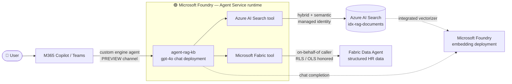

# 03d — Microsoft Foundry agent setup (licensing-driven alternative to Copilot Studio)

This document is an **alternative to [03c-copilot-studio-setup.md](./03c-copilot-studio-setup.md)**. It builds the same user-facing knowledge-base agent, but on the **Microsoft Foundry Agent Service** runtime instead of Copilot Studio, and surfaces it in **Microsoft Teams + Microsoft 365 Copilot** through the **custom engine agent** channel.

> **Run *either* 03c *or* 03d — not both.** They are two implementations of **Layer 3 (the conversational layer)**. Everything underneath — the Fabric ingest pipeline ([03b](./03b-fabric-setup.md)) and the Azure platform layer (Blob + AI Search index + Foundry model gateway, from [03](./03-deployment-manual.md) or [04](./04-deployment-automated.md)) — is **identical and unchanged**. You only swap how users talk to the index.

> **Why this path exists.** It exists for cases where Copilot Studio publishing surfaces an **additional-licensing requirement**: an agent that connects **Azure AI Search** *and* a **Fabric Data Agent** pulls those in as **premium / capacity-billed connectors**, which is licensed on top of the end users' Microsoft 365 Copilot entitlement (Copilot Studio message-capacity packs or per-user Copilot Studio licenses). Moving the agent runtime to Foundry shifts that cost to **Azure consumption** (pay-as-you-go tokens + tool calls) — which an existing Azure subscription already has a billing path for — while end users keep consuming through the M365 Copilot license they already own. See [07-copilot-studio-vs-foundry.md](./07-copilot-studio-vs-foundry.md) for the full trade-off analysis and decision matrix.

> **Preview boundary — read before committing to production.** Publishing a Foundry agent into **Microsoft 365 Copilot / Teams** (the "custom engine agent" / Microsoft 365 Agents SDK channel) is a **preview** capability. The Foundry agent runtime and the **Azure AI Search tool** are GA; the **Microsoft Fabric (Data Agent) tool is in preview**. The **M365/Teams publishing surface moves quickly** — re-verify the publishing steps (Phase D6) against current Microsoft Learn before you promise a production date. The Copilot Studio path (03c) remains the fully-GA option if you cannot take a preview dependency.

> **Targets the GA Microsoft Foundry Agent Service.** Build on the **generally available Microsoft Foundry Agent Service**, *not* the deprecated **Foundry Agent Service (classic)**. The classic Assistants-API runtime **sunsets 2026-08-26** — verify the timeline and migrate via [navigate from classic](https://learn.microsoft.com/azure/foundry/how-to/navigate-from-classic). Microsoft also renamed the Foundry RBAC roles — **Foundry User / Foundry Owner / Foundry Project Manager** were formerly *Azure AI User / Azure AI Owner / Azure AI Project Manager* (role IDs and permissions unchanged); this doc uses the current names.

> **Time budget.** First-time build: **60–90 minutes** hands-on (longer than 03c — there is more Azure-side wiring), plus the same **1–2 business days** of Teams admin approval for org-wide publishing. Subsequent rebuilds in the same project: **20–30 minutes**.

---

## What you'll build

```
Microsoft Foundry project  (proj-rag-kb)
└── Agent: agent-rag-kb   (model: gpt-4o chat deployment — REQUIRED on this path)
    ├── Instructions / system prompt   (grounding + refusal rules)
    ├── Tools / knowledge
    │     ├── Azure AI Search tool  → idx-rag-documents
    │     │     (project connection → managed identity → Search Index Data Contributor)
    │     └── Microsoft Fabric tool → Fabric Data Agent (structured HR data)
    │           (on-behalf-of caller identity → Fabric workspace + RLS honored)
    └── Channel
          └── Microsoft 365 Copilot + Teams   (custom engine agent, PREVIEW;
                                              Microsoft 365 Agents SDK / Toolkit wrapper,
                                              Entra bot identity → agent endpoint)
```

The agent uses the **Foundry Agent Service runtime** for orchestration: it owns query planning, tool selection (AI Search vs. Fabric Data Agent vs. both), grounding, and citation assembly. The chat-completion model deployment that was **opt-in** for the Copilot Studio path is **required** here — Foundry generates answers on a model *you* deploy and bill, not on the M365 Copilot host model.



---

## Tools vs. knowledge bases — and why both sources are Tools here

In Microsoft Foundry Agent Service you give an agent capabilities by adding **tools**. On every turn the model decides **which tool(s) to call** based on the user's question and your agent instructions (this is *tool selection*). Tools come in two kinds:

| Kind | Job | Examples |
|---|---|---|
| **Knowledge tools** | retrieve / **ground** the answer on data | **Azure AI Search**, **Microsoft Fabric (Data Agent)**, File Search, SharePoint, Grounding with Bing |
| **Action tools** | **execute** something | Function calling, Code Interpreter, OpenAPI, Azure Functions, Logic Apps, MCP |

**This pattern adds Azure AI Search and the Fabric Data Agent as knowledge *tools*** — the agent invokes them; it does **not** attach them as passive "knowledge bases." That is the deliberate choice the rest of this doc follows.

**Agent Tool vs. knowledge base — the distinction:**

| | **Agent Tool** *(what this pattern uses)* | **Knowledge base** *(the other model)* |
|---|---|---|
| Wiring | added to the agent's `tools` array | attached as an always-on grounding source |
| Invocation | the **model decides** per turn whether/which to call; steer with **instructions** and **`tool_choice`** | the runtime **always retrieves** on every turn |
| Multiple sources | the model **routes** between AI Search and Fabric per question | one always-on source |
| Best for | multi-source agents that must pick documents vs. data vs. both | a single, always-relevant corpus |
| Here | Azure AI Search **tool** + Microsoft Fabric **tool** (this doc) | the Copilot Studio "knowledge source" model ([03c](./03c-copilot-studio-setup.md)) |

**Why tools, not a knowledge base, for this agent:** with two sources — unstructured documents *and* structured data — you want the model to **route**: search the documents for wording, query the Fabric Data Agent for numbers, or call both for a cross-source question. Tool selection delivers that; an always-retrieve knowledge base does not. You steer the routing with the **agent instructions** in Phase D4, and can force a specific tool with **`tool_choice`**.

> **Constraints (Foundry Agent Service):** you can add only **one instance of each knowledge-tool type** — one Azure AI Search tool and one Microsoft Fabric tool per agent. The **Azure AI Search tool targets a single index**; to span multiple indexes, use **connected agents**. Action tools (Code Interpreter, Functions, Logic Apps) are **not needed** for this knowledge-base Q&A agent — add one only if the agent must take an action beyond answering.

---

## Phase D0 — Prerequisites & licensing

Confirm these before building. The first three differ materially from the Copilot Studio path.

### D0.1 The licensing delta (why you're here)

| Cost surface | Copilot Studio path (03c) | Foundry agent path (03d) |
|---|---|---|
| **Agent runtime** | Copilot Studio **message capacity** (consumption packs) or per-user Copilot Studio license — **on top of** M365 Copilot | **Azure consumption** — chat-model tokens + tool calls + AI Search query unit + Fabric capacity. Billed to the Azure subscription. |
| **AI Search + Fabric Data Agent connectors** | Surfaced as **premium / capacity-billed connectors** in Power Platform | Native Foundry **tools** — no Power Platform connector licensing |
| **End-user access** | Microsoft 365 Copilot license | Microsoft 365 Copilot license (**unchanged**) |
| **Maker / builder** | Copilot Studio Maker license | **Foundry User** (or Project Manager) RBAC on the Foundry project |

In effect, this replaces a **Power Platform message-pack line item** with **Azure pay-as-you-go**. For an organization already committed to Azure, that is usually the cheaper and more predictable path, and it removes the premium-connector constraint entirely. Quantify both for your scenario with [07 § Licensing deep-dive](./07-copilot-studio-vs-foundry.md#licensing-deep-dive) before deciding.

### D0.2 Chat-model deployment is now REQUIRED

The locked base pattern deploys **only an embedding model** and leaves the chat deployment opt-in (Copilot Studio answers on its own host model). **On the Foundry path you must deploy a chat model** — the agent generates answers on it.

- Set `chatModelName` to `gpt-4o` (or `gpt-4o-mini` for cost-sensitive demos) in `infra/main.parameters.local.json` and redeploy, **or** add the deployment in the Foundry portal (**Models + endpoints → Deploy model**).
- Confirm TPM quota for the chat model in your region (see [02-prerequisites.md § 13](./02-prerequisites.md#13--quotas-to-check-before-you-start)). A demo needs ~10K TPM; production sizing depends on concurrency.

### D0.3 A published Fabric Data Agent (for the structured-data tool)

The **Azure AI Search tool** grounds on the unstructured document corpus you already indexed. The **Fabric Data Agent tool** adds a complementary capability — conversational Q&A over **structured** data (e.g. counts, amounts, dates pulled from a Lakehouse / Warehouse / semantic model).

**Build and publish the Fabric Data Agent first** — the full step-by-step (load the structured sample tables → create → ground with instructions + example questions → publish, plus the on-behalf-of security model) is in **[03e-fabric-data-agent.md](./03e-fabric-data-agent.md)**. It uses the in-repo structured sample ([`samples/structured/`](../samples/structured/)), which corresponds to the uploaded document set so the two knowledge sources stay consistent. Phase D3 below connects the published agent.

Tenant settings: the Fabric admin must enable **Copilot and Azure OpenAI** and **Data Agent** creation ([Fabric admin portal](https://learn.microsoft.com/fabric/admin/service-admin-portal-copilot)).

> If your deployment only needs unstructured-document RAG, **skip the Fabric tool** (Phase D3) and 03e — the AI Search tool alone reproduces the 03c agent on the Foundry runtime, and you still get the licensing benefit. The Fabric Data Agent is an optional add-on, not a base-pattern requirement.

### D0.4 Builder + tenant prerequisites

| Requirement | Required state | Why |
|---|---|---|
| **Microsoft Foundry project** | A project exists in a Foundry resource (reuse the `aif-rag-<env>` account from the base deploy, or a project hub bound to it) | Hosts the agent, tools, and connections |
| **Builder RBAC on the project** | **Foundry User** (build agents/connections; formerly *Azure AI User*) — or **Foundry Project Manager** for full project control | Create agent, add tools, create connections |
| **Microsoft 365 Copilot license** (end users) | Assigned to the pilot audience | Required to consume the agent in Teams / M365 Copilot |
| **Teams app upload / admin approval** | Same one-time approval as 03c | Custom engine agent is uploaded as a Teams app |
| **Azure consumption budget** | Subscription with PAYG enabled + a cost alert | Replaces Copilot Studio message packs |

---

## Phase D1 — Foundry project + chat model deployment

1. Open the **Microsoft Foundry portal** ([ai.azure.com](https://ai.azure.com)) and select (or create) a project bound to your `aif-rag-<env>` resource. Reusing the existing Foundry account keeps the embedding deployment, RBAC surface, and region aligned with the index.
2. Under **Models + endpoints**, confirm the **embedding** deployment (`text-embedding-3-large`) exists and **deploy the chat model** (`gpt-4o`) from D0.2 if it is not already there.
3. Note the **project endpoint** and **project name** — Phase D6 needs them.

Reference: [Microsoft Foundry Agent Service overview](https://learn.microsoft.com/azure/foundry/agents/overview).

---

## Phase D2 — Add the Azure AI Search tool

This grounds the agent on the **same `idx-rag-documents` index** the Copilot Studio path used — no re-indexing. The Azure AI Search tool targets **one index** and must be in the **same tenant** as the search service.

1. **Create the project connection.** In the Foundry portal, open your project → **Management center → Connected resources → New connection → Azure AI Search** → select `srch-rag-<env>`. Choose **Managed identity** for authentication (key-based auth isn't supported with private networking, and admin/query keys are disabled on this service per the locked design — [01 § Trust boundaries](./01-architecture.md#trust-boundaries--security)).
2. **Grant the project's managed identity** the roles the tool needs on the search service (see RBAC summary). The current docs prescribe **Search Index Data Contributor** + **Search Service Contributor** (these also cover creating an index from the portal). For **read-only query of an existing index** — this pattern — **Search Index Data Reader** is the least-privilege alternative.
3. **Index requirement.** The tool requires a vector-search index: at least one `Edm.String` field that is *searchable + retrievable* and one `Collection(Edm.Single)` *searchable* vector field. `idx-rag-documents` already satisfies this.
4. **Add the tool to the agent** (Phase D4): add the **Azure AI Search** tool, point it at this connection + the `idx-rag-documents` index, and select the **vector semantic** query type so it uses the integrated vectorizer + semantic ranker you already configured.

> The integrated vectorizer still embeds the user's query via the AI Search → Foundry **Cognitive Services OpenAI User** grant from the base deploy ([modules/rbac.bicep](../infra/modules/rbac.bicep)) — query-time embedding is owned by AI Search, not the agent.

Reference: [Azure AI Search tool (Microsoft Foundry Agent Service)](https://learn.microsoft.com/azure/foundry/agents/how-to/tools/ai-search).

---

## Phase D3 — Add the Microsoft Fabric (Data Agent) tool (structured data)

> Skip this phase if your deployment is unstructured-document-only (see D0.3 note). The Microsoft Fabric tool is in **preview**.

The Fabric Data Agent is the **second knowledge tool** — it grounds answers on **structured** data by translating the question to a query (NL2SQL / NL2DAX), rather than retrieving document chunks. It must be in the **same tenant** as the Foundry project, and it authenticates **only** with the **signed-in user's identity (On-Behalf-Of)** — **service principal auth is not supported.**

1. **Get the data agent's IDs.** In Microsoft Fabric, open the data agent you published per [03e](./03e-fabric-data-agent.md). Copy the **`workspace_id`** and **`artifact_id`** from the URL — the path looks like `.../groups/<workspace_id>/aiskills/<artifact_id>...` (both are GUIDs).
2. **Create the project connection.** In the Foundry portal → **Management center → Connected resources → New connection → Microsoft Fabric** → enter the `workspace_id` and `artifact_id` → save → copy the **connection ID**.
3. **Add the tool to the agent** (Phase D4) using that connection.
4. **Identity & access (On-Behalf-Of).** At runtime the tool queries Fabric as the **signed-in end user**, so each user only sees data they're permitted to — workspace permissions + **row-/object-level security** are enforced per user. Every end user (not just the builder) needs **Read** access to the data agent **and** the minimum permission on each underlying source:

   | Data source | Minimum permission |
   |---|---|
   | Lakehouse | **Read** on the lakehouse item (+ table access if enforced) |
   | Warehouse | **Read** (SELECT on relevant tables) |
   | Power BI semantic model | **Build** (Read alone is insufficient for model queries) |
   | KQL database | **Reader** |

> The chat model you deploy for the agent is used only for **orchestration + response generation** — it does **not** change the model the Fabric Data Agent uses for NL2SQL. The custom engine agent channel (Phase D6) is what carries the user's identity into the call.

Reference: [Microsoft Fabric tool (preview)](https://learn.microsoft.com/azure/foundry/agents/how-to/tools/fabric) · [Fabric Data Agent](https://learn.microsoft.com/fabric/data-science/concept-data-agent).

---

## Phase D4 — Author the agent: instructions + tool routing

The Foundry runtime has no equivalent of Copilot Studio's "Allow ungrounded responses: Off" toggle — your **agent instructions** are both the grounding guardrail *and* the tool-routing logic. Microsoft's guidance is to describe, **per tool**, what it is, when to call it, and an example query, and to tell the model to prefer tool outputs over its own knowledge. Paste and adapt the block below.

### D4.1 Agent instructions (copy-paste starting point)

```text
You are an HR knowledge assistant. Answer questions about an organization's HR
documents and HR data using ONLY the two tools below. If neither tool returns
relevant content, say you don't have that information — never answer from your
own general knowledge, and never guess names, dates, amounts, or clause wording.

TOOLS

1) Azure AI Search tool — "<ai_search_tool_name>"
   - What it is: full-text + vector search over the HR document corpus
     (offer letters, NDAs, severance agreements, contractor agreements).
   - Use it for: the wording or presence of clauses, policy language, and any
     question about what a specific document says.
   - Example queries: "What is the non-compete period in the VP of Product offer
     letter?"  /  "Summarize the IP-assignment clause in the US contractor agreements."
   - Always cite the source document for answers from this tool.

2) Microsoft Fabric tool — "<fabric_tool_name>"
   - What it is: a Fabric Data Agent over structured HR tables (employees,
     agreements) that answers with counts, filters, and aggregates.
   - Use it for: "how many", "average", "list", "which", totals — any question
     answered by numbers or records rather than document wording.
   - Example queries: "How many executive-level offers are there?"  /  "Average
     annual base salary for US senior roles?"  /  "List every agreement in the DE region."
   - Filter on amount_basis before averaging amounts; do not convert currencies.

ROUTING
- Document-wording question        -> Azure AI Search tool.
- Counts / aggregates / lists       -> Microsoft Fabric tool.
- Needs both (e.g. a person's salary AND a clause) -> call both, then combine:
  the number from Fabric, the wording (with citation) from AI Search.

Always prefer tool outputs over your own knowledge. Be concise, and cite the
source document for every document-based answer.
```

Replace `<ai_search_tool_name>` / `<fabric_tool_name>` with the names you give the tools when you add them — **the model routes by these names**, so make them descriptive (e.g. `hr_documents_search`, `hr_data_agent`).

### D4.2 Force a tool when you need determinism

Instructions guide the model but don't guarantee a call. To **force** (or disable) a specific tool — e.g. a test that must exercise the Fabric tool — set the run's **`tool_choice`** parameter to the tool type (for example `tool_choice={"type": "fabric_dataagent"}` or `{"type": "azure_ai_search"}`); leave it `auto` (the default) for normal routing. See [Controlling tool invocation](https://learn.microsoft.com/azure/foundry/agents/concepts/tool-catalog).

### D4.3 Document-level security trimming (same nuance as 03c)

The AI Search index carries a `group_ids` security-trim field ([01 § Document-level access control](./01-architecture.md#document-level-chunk-level-access-control)). For per-user trimming the agent must inject the **caller's Entra group IDs** as an OData `$filter` on the AI Search tool:
`group_ids/any(g: search.in(g, '<caller group IDs>'))`
The custom engine agent channel supplies the caller identity; mapping that identity to group IDs and passing the filter is **deployment-specific wiring** — validate it end-to-end ([05 § G](./05-testing.md)) rather than assuming it is automatic. For structured data, trimming is enforced by Fabric RLS via the On-Behalf-Of identity (Phase D3) — a cleaner per-user story than the document side.

---

## Phase D5 — Test in the Foundry playground

1. Open the agent in the **playground** and run the same question classes as 03c § C4: factual lookup, paraphrased, multi-document, **structured-data** (exercises the Fabric tool), and **out-of-corpus** (must refuse).
2. Confirm citations resolve to the Blob `raw/` source files and that Fabric answers cite the data agent.
3. If you configured security trimming, test **in-group sees / out-of-group trimmed** against two test users before exposing the channel.

---

## Phase D6 — Publish to Microsoft 365 Copilot + Teams (PREVIEW)

> **Re-verify every step here against current Microsoft Learn** — this is the most frequently updated area of the pattern.

The Foundry agent is exposed to Teams / M365 Copilot as a **custom engine agent**: a thin Microsoft 365 Agents SDK app (a bot registration) that forwards user turns to your Foundry agent endpoint and streams responses back.

1. **Wrap the agent** with the **Microsoft 365 Agents Toolkit** (VS Code) — scaffold a custom engine agent that targets your Foundry **project endpoint + agent ID** from Phase D1. The toolkit generates the Teams app manifest and the bot.
2. **Entra bot identity.** The generated bot has its own Entra app registration; grant it access to call the Foundry agent (the project connection / **Foundry User** on the project, or the API-key connection the toolkit configures). This bot identity is the trust bridge between Teams and Foundry.
3. **Carry the user identity** so on-behalf-of (Phase D3) and security trimming (Phase D4) work — configure SSO on the bot so the caller's token, not just the bot's, reaches the agent.
4. **Sideload for the pilot** (just you / your team) to validate in Teams and M365 Copilot.
5. **Org-wide publish** goes through the **Teams admin center → Manage apps** approval — the same 1–2 business-day gate as 03c § C0.2. The agent appears in the Teams app store and the M365 Copilot agent list for licensed users.

Reference: [Build agents with the Microsoft 365 Agents SDK](https://learn.microsoft.com/microsoft-365/agents-sdk/) · [Custom engine agents for Microsoft 365 Copilot](https://learn.microsoft.com/microsoft-365-copilot/extensibility/overview-custom-engine-agent) · [Agents Toolkit](https://learn.microsoft.com/microsoftteams/platform/toolkit/agents-toolkit-fundamentals).

### Alternative front end — standalone web app

The M365/Teams custom engine agent is one way to reach the agent; it is not the only one. For a **self-hosted, brandable web chat UI** (e.g. an internal portal) outside Teams/M365, this repo ships a minimal in-repo app ([`webapp/app/`](../webapp/app/)) that you deploy onto Azure Container Apps with the project's own flow — no external sample, no separate toolchain. Use **MI mode** (default) for an AI-Search-only agent, or **On-Behalf-Of (OBO)** mode, which is **required** for the Fabric data agent tool to pass the user's identity through. Full runbook: **[09-foundry-agent-webapp.md](./09-foundry-agent-webapp.md)**. The agent runtime and tools are unchanged; only the client differs.

---

## RBAC summary — high-level

This is the **complete identity map** for the Foundry-agent path. Three identities matter: the **AI Search service MI** (unchanged from base), the **Foundry project MI** (new — for the AI Search tool), and the **caller's user identity** (flowed through for Fabric + security trimming). Builder and bot identities round it out.

> For the **full cross-layer picture** (ingest → platform → agent) and **how per-user restrictions propagate** — AI Search filter injection vs. Fabric On-Behalf-Of RLS/OLS/Purview — see **[08-rbac-and-identity-passthrough.md](./08-rbac-and-identity-passthrough.md)**.

### Machine-to-machine (runtime)

| Principal | Role | Scope | Why | New? |
|---|---|---|---|---|
| **AI Search service MI** | **Cognitive Services OpenAI User** | Foundry resource | Integrated vectorizer embeds queries — the silent-failure trap if wrong ([06 § 4.1](./06-troubleshooting.md)) | Unchanged (base) |
| **AI Search service MI** | **Storage Blob Data Reader** | Storage account | Indexer pulls chunk JSON | Unchanged (base) |
| **Foundry resource MI** | **Storage Blob Data Reader** | Storage account | Document Intelligence fetches `raw/` via `urlSource` | Unchanged (base) |
| **Foundry *project* MI** | **Search Index Data Contributor** + **Search Service Contributor** (or **Search Index Data Reader** for read-only) | AI Search service | **Agent's AI Search tool queries the index** | **New (D2)** |
| **Foundry project MI / caller** | **Cognitive Services OpenAI User** | Foundry resource | Agent generates answers on the chat deployment | **New (D1)** |
| **Caller user identity (OBO)** | **Read** on the data agent + sources (Lakehouse Read; semantic model Build) | Fabric workspace | Fabric Data Agent answers within the user's RLS scope — **user identity only, no service principal** | **New (D3)** |

### Builder + channel identities

| Principal | Role | Scope | Why |
|---|---|---|---|
| Building user / deploy SP | **Foundry User** (or **Foundry Project Manager**) | Foundry project | Create agent, tools, connections, deployments |
| Custom-engine-agent **bot** (Entra app) | **Foundry User** (or the project connection the toolkit configures) | Foundry project / agent | Teams bot forwards turns to the agent endpoint |
| End users | **Microsoft 365 Copilot** license | M365 tenant | Consume the agent in Teams / M365 Copilot |
| Teams admin | App approval | Teams admin center | One-time org-wide publish gate |

> **The two-line answer for "what's needed for RBAC":** (1) grant the **Foundry project managed identity** the AI Search tool roles on the search service (`Search Index Data Contributor` + `Search Service Contributor`, or `Search Index Data Reader` for read-only) so the agent can query the index, and (2) flow the **caller's user identity (on-behalf-of)** into the Fabric Data Agent so HR row-level security is enforced per user. Everything else is either already in place from the base deploy or a standard Foundry builder/bot grant.

---

## Security & data-residency notes

- **No keys anywhere.** Keep the no-local-auth posture: managed identity for the AI Search tool, on-behalf-of for Fabric, Entra for the bot. If the Agents Toolkit defaults to an API-key project connection, replace it with managed identity before production.
- **Per-user trimming is split across two mechanisms.** Document side = AI Search `group_ids` filter (must be injected). Structured side = Fabric RLS via OBO (automatic once OBO is wired). Validate both with two test users.
- **Network.** For production, put the AI Search and Foundry resources behind **private endpoints** and keep the agent's tool traffic on the Azure backbone ([01 § Network](./01-architecture.md#trust-boundaries--security)). The M365/Teams channel egress is Microsoft-managed.
- **Data residency.** The chat deployment now processes prompt + retrieved content — keep the chat model in the **same region** as the index and Blob, consistent with [02 § 11](./02-prerequisites.md#11--regional-alignment).

---

## Validation checklist

- [ ] Chat model deployed on the Foundry resource and in-region quota confirmed (D0.2)
- [ ] Foundry project MI granted the AI Search tool roles (**Search Index Data Contributor** + **Search Service Contributor**, or **Reader** for read-only) on AI Search (D2)
- [ ] AI Search tool returns grounded answers with citations to Blob `raw/` files in the playground (D5)
- [ ] (If in scope) Fabric Data Agent published and connected with **on-behalf-of** identity (D3)
- [ ] Out-of-corpus question is **refused** (prompt guardrail working) (D4/D5)
- [ ] (If configured) security trimming: in-group sees / out-of-group trimmed, validated with two users (D5)
- [ ] Custom engine agent sideloaded; reachable in Teams **and** M365 Copilot as a normal licensed user (D6)
- [ ] Caller identity (SSO) reaches the agent so OBO + trimming hold through the channel (D6)
- [ ] Org-wide publish approved in Teams admin center (D6)

---

## When to fall back to Copilot Studio (03c)

Choose 03c instead of this path when **any** of these hold — full matrix in [07](./07-copilot-studio-vs-foundry.md#decision-matrix):

- You **cannot take a preview dependency** for production (M365 publishing from Foundry is preview).
- There is **no maker/dev capacity** to operate Microsoft Foundry + the Agents Toolkit wrapper.
- The agent is **unstructured-document RAG only**, the audience is small, and Copilot Studio message capacity is already licensed — the licensing driver doesn't apply.

---

## References

- [Microsoft Foundry Agent Service — overview](https://learn.microsoft.com/azure/foundry/agents/overview) · [tool catalog](https://learn.microsoft.com/azure/foundry/agents/concepts/tool-catalog)
- [Azure AI Search tool](https://learn.microsoft.com/azure/foundry/agents/how-to/tools/ai-search)
- [Microsoft Fabric tool (preview)](https://learn.microsoft.com/azure/foundry/agents/how-to/tools/fabric)
- [Role-based access control in Microsoft Foundry](https://learn.microsoft.com/azure/foundry/concepts/rbac-foundry)
- [Fabric Data Agent concept](https://learn.microsoft.com/fabric/data-science/concept-data-agent) · [create](https://learn.microsoft.com/fabric/data-science/how-to-create-data-agent)
- [Custom engine agents for Microsoft 365 Copilot](https://learn.microsoft.com/microsoft-365-copilot/extensibility/overview-custom-engine-agent)
- [Microsoft 365 Agents SDK](https://learn.microsoft.com/microsoft-365/agents-sdk/) · [Agents Toolkit](https://learn.microsoft.com/microsoftteams/platform/toolkit/agents-toolkit-fundamentals)
- Companion decision guide: [07-copilot-studio-vs-foundry.md](./07-copilot-studio-vs-foundry.md)

---

*Last updated: 2026-06-09*
