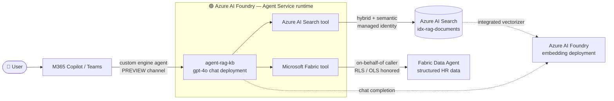

# 03d — Azure AI Foundry agent setup (licensing-driven alternative to Copilot Studio)

This document is an **alternative to [03c-copilot-studio-setup.md](./03c-copilot-studio-setup.md)**. It builds the same user-facing knowledge-base agent, but on the **Azure AI Foundry Agent Service** runtime instead of Copilot Studio, and surfaces it in **Microsoft Teams + Microsoft 365 Copilot** through the **custom engine agent** channel.

> **Run *either* 03c *or* 03d — not both.** They are two implementations of **Layer 3 (the conversational layer)**. Everything underneath — the Fabric ingest pipeline ([03b](./03b-fabric-setup.md)) and the Azure platform layer (Blob + AI Search index + Foundry model gateway, from [03](./03-deployment-manual.md) or [04](./04-deployment-automated.md)) — is **identical and unchanged**. You only swap how users talk to the index.

> **Why this path exists.** It exists for cases where Copilot Studio publishing surfaces an **additional-licensing requirement**: an agent that connects **Azure AI Search** *and* a **Fabric Data Agent** pulls those in as **premium / capacity-billed connectors**, which is licensed on top of the end users' Microsoft 365 Copilot entitlement (Copilot Studio message-capacity packs or per-user Copilot Studio licenses). Moving the agent runtime to Foundry shifts that cost to **Azure consumption** (pay-as-you-go tokens + tool calls) — which an existing Azure subscription already has a billing path for — while end users keep consuming through the M365 Copilot license they already own. See [07-copilot-studio-vs-foundry.md](./07-copilot-studio-vs-foundry.md) for the full trade-off analysis and decision matrix.

> **Preview boundary — read before committing to production.** Publishing an Azure AI Foundry agent into **Microsoft 365 Copilot / Teams** (the "custom engine agent" / Microsoft 365 Agents SDK channel) is a **preview** capability at the time of writing. The Foundry agent runtime, the **Azure AI Search tool**, and the **Microsoft Fabric (Data Agent) tool** are generally available or in advanced preview, but the **M365/Teams publishing surface moves quickly** — re-verify the publishing steps (Phase D6) against current Microsoft Learn before you promise a production date. The Copilot Studio path (03c) remains the fully-GA option if you cannot take a preview dependency.

> **Time budget.** First-time build: **60–90 minutes** hands-on (longer than 03c — there is more Azure-side wiring), plus the same **1–2 business days** of Teams admin approval for org-wide publishing. Subsequent rebuilds in the same project: **20–30 minutes**.

---

## What you'll build

```
Azure AI Foundry project  (proj-rag-kb)
└── Agent: agent-rag-kb   (model: gpt-4o chat deployment — REQUIRED on this path)
    ├── Instructions / system prompt   (grounding + refusal rules)
    ├── Tools / knowledge
    │     ├── Azure AI Search tool  → idx-rag-documents
    │     │     (project connection → Managed identity → Search Index Data Reader)
    │     └── Microsoft Fabric tool → Fabric Data Agent (structured HR data)
    │           (on-behalf-of caller identity → Fabric workspace + RLS honored)
    └── Channel
          └── Microsoft 365 Copilot + Teams   (custom engine agent, PREVIEW;
                                              Microsoft 365 Agents SDK / Toolkit wrapper,
                                              Entra bot identity → agent endpoint)
```

The agent uses the **Foundry Agent Service runtime** for orchestration: it owns query planning, tool selection (AI Search vs. Fabric Data Agent vs. both), grounding, and citation assembly. The chat-completion model deployment that was **opt-in** for the Copilot Studio path is **required** here — Foundry generates answers on a model *you* deploy and bill, not on the M365 Copilot host model.


```mermaid
flowchart LR
    USER([👤 User]) --> M365[M365 Copilot / Teams]
    M365 -->|custom engine agent<br/>PREVIEW channel| AGENT
    subgraph Foundry["🟣 Azure AI Foundry — Agent Service runtime"]
        AGENT[agent-rag-kb<br/>gpt-4o chat deployment]
        T1[Azure AI Search tool]
        T2[Microsoft Fabric tool]
        AGENT --> T1
        AGENT --> T2
    end
    T1 -->|hybrid + semantic<br/>managed identity| SEARCH[(Azure AI Search<br/>idx-rag-documents)]
    T2 -->|on-behalf-of caller<br/>RLS / OLS honored| FDA[Fabric Data Agent<br/>structured HR data]
    SEARCH -.->|integrated vectorizer| AIF[Azure AI Foundry<br/>embedding deployment]
    AGENT -.->|chat completion| AIF
```

---

## Phase D0 — Prerequisites & licensing

Confirm these before building. The first three differ materially from the Copilot Studio path.

### D0.1 The licensing delta (why you're here)

| Cost surface | Copilot Studio path (03c) | Foundry agent path (03d) |
|---|---|---|
| **Agent runtime** | Copilot Studio **message capacity** (consumption packs) or per-user Copilot Studio license — **on top of** M365 Copilot | **Azure consumption** — chat-model tokens + tool calls + AI Search query unit + Fabric capacity. Billed to the Azure subscription. |
| **AI Search + Fabric Data Agent connectors** | Surfaced as **premium / capacity-billed connectors** in Power Platform | Native Foundry **tools** — no Power Platform connector licensing |
| **End-user access** | Microsoft 365 Copilot license | Microsoft 365 Copilot license (**unchanged**) |
| **Maker / builder** | Copilot Studio Maker license | **Azure AI Developer** (or Project Manager) RBAC on the Foundry project |

The net: you trade a **Power Platform message-pack line item** for **Azure pay-as-you-go**. For an Azure-committed organization that is usually the cheaper and more predictable path, and it removes the premium-connector blocker entirely. Quantify both for your scenario with [07 § Licensing deep-dive](./07-copilot-studio-vs-foundry.md#licensing-deep-dive) before deciding.

### D0.2 Chat-model deployment is now REQUIRED

The locked base pattern deploys **only an embedding model** and leaves the chat deployment opt-in (Copilot Studio answers on its own host model). **On the Foundry path you must deploy a chat model** — the agent generates answers on it.

- Set `chatModelName` to `gpt-4o` (or `gpt-4o-mini` for cost-sensitive demos) in `infra/main.parameters.local.json` and redeploy, **or** add the deployment in the Foundry portal (**Models + endpoints → Deploy model**).
- Confirm TPM quota for the chat model in your region (see [02-prerequisites.md § 13](./02-prerequisites.md#13--quotas-to-check-before-you-start)). A demo needs ~10K TPM; production sizing depends on concurrency.

### D0.3 A published Fabric Data Agent (for the structured-data tool)

The **Azure AI Search tool** grounds on the unstructured document corpus you already indexed. The **Fabric Data Agent tool** adds a complementary capability — conversational Q&A over **structured** data (e.g. counts, amounts, dates pulled from a Lakehouse / Warehouse / semantic model).

You must **create and publish the Fabric Data Agent in Fabric first**:

1. In the Fabric workspace (`ws-rag-<env>` from [03b](./03b-fabric-setup.md)), create a **Data Agent** and attach the data sources it may query (Lakehouse tables, a Warehouse, or a Power BI semantic model).
2. Give it clear instructions and example questions so its NL-to-query grounding is reliable.
3. **Publish** it and note the workspace + data-agent identifiers — Phase D3 connects to it.
4. Tenant settings: the Fabric admin must enable **Copilot and Azure OpenAI** and **users can create and use Data Agents** ([Fabric admin portal](https://learn.microsoft.com/fabric/admin/service-admin-portal-copilot)).

Reference: [Fabric Data Agent concept](https://learn.microsoft.com/fabric/data-science/concept-data-agent) · [Create a Data Agent](https://learn.microsoft.com/fabric/data-science/how-to-create-data-agent).

> If your deployment only needs unstructured-document RAG, **skip the Fabric tool** (Phase D3) — the AI Search tool alone reproduces the 03c agent on the Foundry runtime, and you still get the licensing benefit. The Fabric Data Agent is an optional add-on, not a base-pattern requirement.

### D0.4 Builder + tenant prerequisites

| Requirement | Required state | Why |
|---|---|---|
| **Azure AI Foundry project** | A project exists in a Foundry resource (reuse the `aif-rag-<env>` account from the base deploy, or a project hub bound to it) | Hosts the agent, tools, and connections |
| **Builder RBAC on the project** | **Azure AI Developer** (build agents/connections) — or **Azure AI Project Manager** for full project control | Create agent, add tools, create connections |
| **Microsoft 365 Copilot license** (end users) | Assigned to the pilot audience | Required to consume the agent in Teams / M365 Copilot |
| **Teams app upload / admin approval** | Same one-time approval as 03c | Custom engine agent is uploaded as a Teams app |
| **Azure consumption budget** | Subscription with PAYG enabled + a cost alert | Replaces Copilot Studio message packs |

---

## Phase D1 — Foundry project + chat model deployment

1. Open the **Azure AI Foundry portal** ([ai.azure.com](https://ai.azure.com)) and select (or create) a project bound to your `aif-rag-<env>` resource. Reusing the existing Foundry account keeps the embedding deployment, RBAC surface, and region aligned with the index.
2. Under **Models + endpoints**, confirm the **embedding** deployment (`text-embedding-3-large`) exists and **deploy the chat model** (`gpt-4o`) from D0.2 if it is not already there.
3. Note the **project endpoint** and **project name** — Phase D6 needs them.

Reference: [What is Azure AI Foundry Agent Service](https://learn.microsoft.com/azure/ai-foundry/agents/overview).

---

## Phase D2 — Connect Azure AI Search as a knowledge tool

This grounds the agent on the **same `idx-rag-documents` index** the Copilot Studio path used — no re-indexing.

1. In the project, open **Management center → Connected resources → New connection → Azure AI Search**.
2. Select the `srch-rag-<env>` service. For **authentication, choose the project's managed identity** (not an API key) — admin/query keys are disabled on this service per the locked design ([01 § Trust boundaries](./01-architecture.md#trust-boundaries--security)).
3. Grant the **project managed identity** the **Search Index Data Reader** role on the search service (RBAC table below). This is read-only query access — narrower than the deployer's build-time roles.
4. In the agent (Phase D4), add the **Azure AI Search** tool, point it at this connection and the `idx-rag-documents` index, and select **semantic** query type with the **vector** profile so it uses the integrated vectorizer + semantic ranker you already configured.

> The integrated vectorizer still embeds the user's query via the AI Search → Foundry **Cognitive Services OpenAI User** grant that already exists from the base deploy ([modules/rbac.bicep](../infra/modules/rbac.bicep)). Nothing changes there — query-time embedding is owned by AI Search, not the agent.

Reference: [Azure AI Search tool for Foundry Agent Service](https://learn.microsoft.com/azure/ai-foundry/agents/how-to/tools/azure-ai-search).

---

## Phase D3 — Connect the Fabric Data Agent as a tool (structured HR data)

> Skip this phase if your deployment is unstructured-document-only (see D0.3 note).

1. In the project, add the **Microsoft Fabric** tool to the agent and create a connection to the **Fabric Data Agent** you published in D0.3 (you supply the Fabric workspace + data-agent identifiers / endpoint).
2. **Identity model — choose deliberately; this is the HR-data security decision:**

   | Identity mode | Behavior | Use for |
   |---|---|---|
   | **On-behalf-of (delegated user identity)** — **recommended for HR** | The signed-in user's identity flows to Fabric; the Data Agent answers **only over data that user is permitted to see** — workspace permissions + **row-level / object-level security** are enforced per user. | Any data with per-employee / per-role sensitivity (comp, PII, manager-only views). |
   | **Fixed service identity** | All callers query Fabric as one identity; everyone sees the same scope. Simpler, but **no per-user trimming**. | Non-sensitive, uniformly-shareable reference data only. |

3. For on-behalf-of, the **end user** (not just the builder) needs at least **Viewer** on the Fabric workspace and read/build on the underlying semantic model or Lakehouse. The custom engine agent channel (Phase D6) is what carries the user's identity into the call.

Reference: [Microsoft Fabric tool for Foundry Agent Service](https://learn.microsoft.com/azure/ai-foundry/agents/how-to/tools/fabric) · [Fabric Data Agent security](https://learn.microsoft.com/fabric/data-science/data-agent-consume).

---

## Phase D4 — Author the agent (instructions, grounding, security trimming)

1. **Instructions / system prompt.** State the persona, the corpus scope, and **hard refusal rules** — the Foundry runtime has no equivalent of Copilot Studio's "Allow ungrounded responses: Off" toggle, so the guardrail lives in the prompt. Recommended spine:
   - *"Answer only from the Azure AI Search knowledge tool and the Fabric Data Agent tool. If neither returns relevant content, say you don't have that information. Always cite the source document for document answers. Never use general world knowledge for HR-policy or HR-data questions."*
2. **Tool routing.** Tell the agent **when to use which tool**: AI Search for policy/contract/letter wording; Fabric Data Agent for counts, aggregates, and structured lookups; both when a question spans prose + data.
3. **Document-level security trimming (same nuance as 03c).** The AI Search index carries a `group_ids` security-trim field ([01 § Document-level access control](./01-architecture.md#document-level-chunk-level-access-control)). For per-user trimming the agent must inject the **caller's Entra group IDs** as an OData `$filter` on the AI Search tool:
   `group_ids/any(g: search.in(g, '<caller group IDs>'))`
   The custom engine agent channel supplies the caller identity; mapping that identity to group IDs and passing the filter is **deployment-specific wiring** — validate it end-to-end ([05 § G](./05-testing.md)) rather than assuming it is automatic. For structured data, trimming is enforced by Fabric RLS via the on-behalf-of identity (Phase D3) — a cleaner per-user story than the document side.

---

## Phase D5 — Test in the Foundry playground

1. Open the agent in the **playground** and run the same question classes as 03c § C4: factual lookup, paraphrased, multi-document, **structured-data** (exercises the Fabric tool), and **out-of-corpus** (must refuse).
2. Confirm citations resolve to the Blob `raw/` source files and that Fabric answers cite the data agent.
3. If you configured security trimming, test **in-group sees / out-of-group trimmed** against two test users before exposing the channel.

---

## Phase D6 — Publish to Microsoft 365 Copilot + Teams (PREVIEW)

> **Re-verify every step here against current Microsoft Learn** — this is the fastest-moving surface in the pattern.

The Foundry agent is exposed to Teams / M365 Copilot as a **custom engine agent**: a thin Microsoft 365 Agents SDK app (a bot registration) that forwards user turns to your Foundry agent endpoint and streams responses back.

1. **Wrap the agent** with the **Microsoft 365 Agents Toolkit** (VS Code) — scaffold a custom engine agent that targets your Foundry **project endpoint + agent ID** from Phase D1. The toolkit generates the Teams app manifest and the bot.
2. **Entra bot identity.** The generated bot has its own Entra app registration; grant it access to call the Foundry agent (the project connection / `Azure AI User` on the project, or the API-key connection the toolkit configures). This bot identity is the trust bridge between Teams and Foundry.
3. **Carry the user identity** so on-behalf-of (Phase D3) and security trimming (Phase D4) work — configure SSO on the bot so the caller's token, not just the bot's, reaches the agent.
4. **Sideload for the pilot** (just you / your team) to validate in Teams and M365 Copilot.
5. **Org-wide publish** goes through the **Teams admin center → Manage apps** approval — the same 1–2 business-day gate as 03c § C0.2. The agent appears in the Teams app store and the M365 Copilot agent list for licensed users.

Reference: [Build agents with the Microsoft 365 Agents SDK](https://learn.microsoft.com/microsoft-365/agents-sdk/) · [Custom engine agents for Microsoft 365 Copilot](https://learn.microsoft.com/microsoft-365-copilot/extensibility/overview-custom-engine-agent) · [Agents Toolkit](https://learn.microsoft.com/microsoftteams/platform/toolkit/agents-toolkit-fundamentals).

---

## RBAC summary — high-level

This is the **complete identity map** for the Foundry-agent path. Three identities matter: the **AI Search service MI** (unchanged from base), the **Foundry project MI** (new — for the AI Search tool), and the **caller's user identity** (flowed through for Fabric + security trimming). Builder and bot identities round it out.

### Machine-to-machine (runtime)

| Principal | Role | Scope | Why | New? |
|---|---|---|---|---|
| **AI Search service MI** | **Cognitive Services OpenAI User** | Foundry resource | Integrated vectorizer embeds queries — the silent-failure trap if wrong ([06 § 4.1](./06-troubleshooting.md)) | Unchanged (base) |
| **AI Search service MI** | **Storage Blob Data Reader** | Storage account | Indexer pulls chunk JSON | Unchanged (base) |
| **Foundry resource MI** | **Storage Blob Data Reader** | Storage account | Document Intelligence fetches `raw/` via `urlSource` | Unchanged (base) |
| **Foundry *project* MI** | **Search Index Data Reader** | AI Search service | **Agent's AI Search tool runs read-only queries** | **New (D2)** |
| **Foundry project MI / caller** | **Cognitive Services OpenAI User** | Foundry resource | Agent generates answers on the chat deployment | **New (D1)** |
| **Caller user identity (OBO)** | **Viewer** (+ model read/build) | Fabric workspace / semantic model | Fabric Data Agent answers within the user's RLS/OLS scope | **New (D3)** |

### Builder + channel identities

| Principal | Role | Scope | Why |
|---|---|---|---|
| Building user / deploy SP | **Azure AI Developer** (or **Project Manager**) | Foundry project | Create agent, tools, connections, deployments |
| Custom-engine-agent **bot** (Entra app) | **Azure AI User** (or the project connection the toolkit configures) | Foundry project / agent | Teams bot forwards turns to the agent endpoint |
| End users | **Microsoft 365 Copilot** license | M365 tenant | Consume the agent in Teams / M365 Copilot |
| Teams admin | App approval | Teams admin center | One-time org-wide publish gate |

> **The two-line answer for "what's needed for RBAC":** (1) grant the **Foundry project managed identity `Search Index Data Reader`** on the search service so the agent can query the index, and (2) flow the **caller's user identity (on-behalf-of)** into the Fabric Data Agent so HR row-level security is enforced per user. Everything else is either already in place from the base deploy or a standard Azure AI Foundry builder/bot grant.

---

## Security & data-residency notes

- **No keys anywhere.** Keep the no-local-auth posture: managed identity for the AI Search tool, on-behalf-of for Fabric, Entra for the bot. If the Agents Toolkit defaults to an API-key project connection, replace it with managed identity before production.
- **Per-user trimming is split across two mechanisms.** Document side = AI Search `group_ids` filter (must be injected). Structured side = Fabric RLS via OBO (automatic once OBO is wired). Validate both with two test users.
- **Network.** For production, put the AI Search and Foundry resources behind **private endpoints** and keep the agent's tool traffic on the Azure backbone ([01 § Network](./01-architecture.md#trust-boundaries--security)). The M365/Teams channel egress is Microsoft-managed.
- **Data residency.** The chat deployment now processes prompt + retrieved content — keep the chat model in the **same region** as the index and Blob, consistent with [02 § 11](./02-prerequisites.md#11--regional-alignment).

---

## Validation checklist

- [ ] Chat model deployed on the Foundry resource and in-region quota confirmed (D0.2)
- [ ] Foundry project MI granted **Search Index Data Reader** on AI Search (D2)
- [ ] AI Search tool returns grounded answers with citations to Blob `raw/` files in the playground (D5)
- [ ] (If in scope) Fabric Data Agent published and connected with **on-behalf-of** identity (D3)
- [ ] Out-of-corpus question is **refused** (prompt guardrail working) (D4/D5)
- [ ] (If configured) security trimming: in-group sees / out-of-group trimmed, validated with two users (D5)
- [ ] Custom engine agent sideloaded; reachable in Teams **and** M365 Copilot as a normal licensed user (D6)
- [ ] Caller identity (SSO) reaches the agent so OBO + trimming hold through the channel (D6)
- [ ] Org-wide publish approved in Teams admin center (D6)

---

## When to fall back to Copilot Studio (03c)

Choose 03c instead of this path when **any** of these hold — full matrix in [07](./07-copilot-studio-vs-foundry.md#decision-matrix):

- You **cannot take a preview dependency** for production (M365 publishing from Foundry is preview).
- There is **no maker/dev capacity** to operate Azure AI Foundry + the Agents Toolkit wrapper.
- The agent is **unstructured-document RAG only**, the audience is small, and Copilot Studio message capacity is already licensed — the licensing driver doesn't apply.

---

## References

- [Azure AI Foundry Agent Service — overview](https://learn.microsoft.com/azure/ai-foundry/agents/overview)
- [Azure AI Search tool](https://learn.microsoft.com/azure/ai-foundry/agents/how-to/tools/azure-ai-search)
- [Microsoft Fabric tool](https://learn.microsoft.com/azure/ai-foundry/agents/how-to/tools/fabric)
- [Role-based access control in Azure AI Foundry](https://learn.microsoft.com/azure/ai-foundry/concepts/rbac-azure-ai-foundry)
- [Fabric Data Agent concept](https://learn.microsoft.com/fabric/data-science/concept-data-agent) · [consume / security](https://learn.microsoft.com/fabric/data-science/data-agent-consume)
- [Custom engine agents for Microsoft 365 Copilot](https://learn.microsoft.com/microsoft-365-copilot/extensibility/overview-custom-engine-agent)
- [Microsoft 365 Agents SDK](https://learn.microsoft.com/microsoft-365/agents-sdk/) · [Agents Toolkit](https://learn.microsoft.com/microsoftteams/platform/toolkit/agents-toolkit-fundamentals)
- Companion decision guide: [07-copilot-studio-vs-foundry.md](./07-copilot-studio-vs-foundry.md)

---

*Last updated: 2026-06-09*
