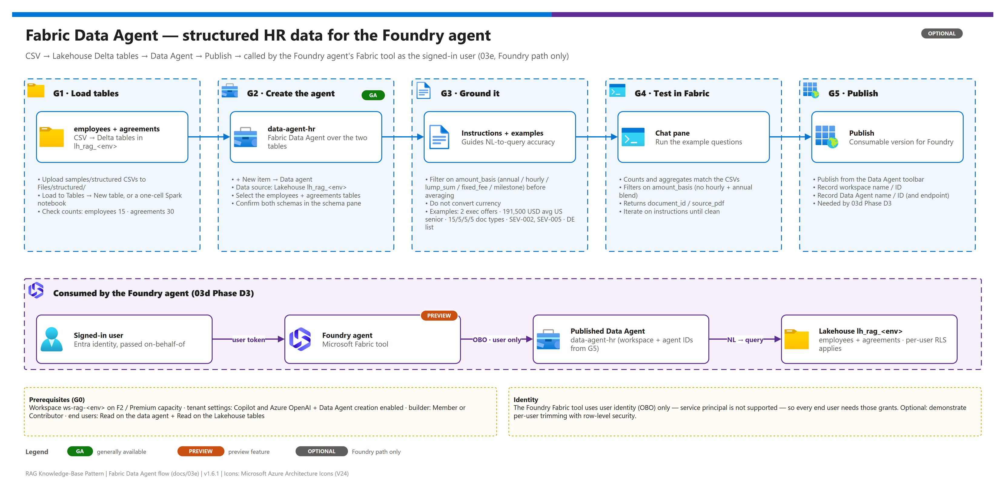

[README](../README.md) › [docs index](./00-reproduce-this-demo.md) › 03e Fabric Data Agent

# 03e — Fabric Data Agent over the structured sample data

<p align="center">
  &nbsp;&nbsp;
  &nbsp;&nbsp;
  &nbsp;&nbsp;
  &nbsp;&nbsp;
  
</p>

    

This document builds the **structured-data knowledge source** for the agent: a **Microsoft Fabric Data Agent** that answers questions over tabular HR data (counts, filters, aggregates) and complements the unstructured **Azure AI Search** index (clauses, wording, citations).

## At a glance

| | Item | Detail |
|---|---|---|
|  | **Data** | `employees.csv` (15 rows) + `agreements.csv` (30 rows) loaded as Lakehouse Delta tables |
|  | **Fabric Data Agent** `data-agent-hr` |  NL-to-query over the two tables |
|  | **Consumer** | Foundry Microsoft Fabric tool (03d Phase D3)  |
|  | **Identity** | On-behalf-of caller identity; RLS honored per user |

> [!IMPORTANT]
> **Optional — Foundry path only.** Only the [Microsoft Foundry agent path (03d)](./03d-foundry-agent-setup.md) wires a Fabric Data Agent (as its **Microsoft Fabric knowledge tool**, Phase D3). Skip this doc if your deployment is unstructured-document-only. *(Copilot Studio can also consume a Fabric Data Agent, but that connector is exactly the premium / message-capacity-billed path 03d exists to avoid — so the Fabric Data Agent is documented on the Foundry path.)*

> [!NOTE]
> **Run order.** Build this **after** the Fabric workspace exists ([03b](./03b-fabric-setup.md)) and **before** [03d Phase D3](./03d-foundry-agent-setup.md#phase-d3--add-the-microsoft-fabric-data-agent-tool-structured-data). It reuses the same workspace and capacity — no new Azure resources.

> [!WARNING]
> **Preview boundary.** The **Fabric Data Agent** (this Fabric feature) is **generally available**; the **Foundry Microsoft Fabric tool** that consumes it (03d Phase D3) is in **preview**. Tenant settings gate the feature and screens move — re-verify against [Fabric Data Agent docs](https://learn.microsoft.com/fabric/data-science/concept-data-agent) at build time.

---

## What you'll build

[](./assets/fabric-data-agent-flow.png)

<sub>Editable source: [`assets/fabric-data-agent-flow.drawio`](./assets/fabric-data-agent-flow.drawio) - regenerate with `python scripts/export_diagrams.py docs/assets`.</sub>

<details><summary><b>Text view of the flow</b></summary>

```
samples/structured/                         (in this repo)
├── employees.csv    (15 rows)   ┐
└── agreements.csv   (30 rows)   ┘ load → Fabric Lakehouse Delta tables
                                          │  (employees, agreements)
                                          ▼
                              Fabric Data Agent  (data-agent-hr)
                                   ├── data source: the two tables
                                   ├── instructions + example questions
                                   └── PUBLISHED
                                          │
                                          ▼  consumed as a knowledge tool by
                              Foundry agent  (03d Phase D3 — on-behalf-of identity)
```

</details>

The CSVs in [`samples/structured/`](../samples/structured/) correspond to a standard synthetic HR document set via the `source_pdf` key (see [samples/README.md](../samples/README.md)) — so once that document set is uploaded to the ingestion flow, a document answer and a data answer about the same person agree. The document corpus itself is uploaded separately ([03b § F4](./03b-fabric-setup.md)); only the structured data ships in this repo.

---

## Phase G0 — Prerequisites

| Requirement | Detail |
|---|---|
| **Fabric workspace + capacity** | Reuse `ws-rag-<env>` from [03b § F1](./03b-fabric-setup.md). F2 (F-SKU) or a Power BI Premium capacity. |
| **Tenant settings** (Fabric admin) | **Copilot and Azure OpenAI** enabled, and **Data Agent** creation enabled for your group ([admin portal](https://learn.microsoft.com/fabric/admin/service-admin-portal-copilot)). |
| **Structured CSVs** | `samples/structured/employees.csv` (15 rows) + `agreements.csv` (30 rows) — ship in this repo. |
| **Builder role** | **Member** or **Contributor** on the workspace (to create + publish the Data Agent). |
| **End-user role** (for 03d on-behalf-of) | **Read** access to the data agent + **Read** on the Lakehouse item/tables. The Foundry Fabric tool uses **user identity (OBO) only — service principal is not supported**, so each end user needs these grants for per-user RLS. |

---

## Phase G1 — Load the structured CSVs into Lakehouse tables

| Step | | Action | Gate |
|---|---|---|---|
| **1** |  | Open Lakehouse `lh_rag_<env>` | ☐ Lakehouse opens |
| **2** |  | Upload both CSVs to `Files/structured/` | ☐ Two files present |
| **3** |  | Convert to Delta tables | ☐ `employees` and `agreements` listed under Tables |
| **4** |  | Validate the row counts | ☐ 15 and 30 rows |

Details for each step:

1. Open the Lakehouse `lh_rag_<env>` from [03b § F3](./03b-fabric-setup.md) (or create a Warehouse if you prefer T-SQL).
2. Upload `employees.csv` and `agreements.csv` into the Lakehouse **Files** area (drag-drop, or `Get data → Upload files`) — e.g. into a `Files/structured/` folder.
3. Convert them to **Delta tables**. Low-code: right-click each CSV → **Load to Tables → New table**. Or run a one-cell notebook against the Lakehouse:

   ```python
   for name in ["employees", "agreements"]:
       (spark.read.option("header", True).option("inferSchema", True)
            .csv(f"Files/structured/{name}.csv")
            .write.mode("overwrite").saveAsTable(name))
   ```

4. Validate the load:

   ```python
   print(spark.table("employees").count())    # expect 15
   print(spark.table("agreements").count())    # expect 30
   spark.table("agreements").groupBy("document_type").count().show()
   # offer_letter 15 | nda 5 | severance_agreement 5 | contractor_agreement 5
   ```

---

## Phase G2 — Create the Fabric Data Agent

| Step | | Action | Gate |
|---|---|---|---|
| **1** |  | **+ New item → Data agent**, name `data-agent-hr` | ☐ Agent created |
| **2** |  | Add the Lakehouse as data source; select both tables | ☐ Two tables selected |
| **3** |  | Check the schema pane | ☐ Tables and columns visible |

Details for each step:

1. In the workspace, **+ New item → Data agent** (also reachable from **New → Data agent**). Name it `data-agent-hr`.
2. **Add a data source → the Lakehouse** `lh_rag_<env>`, and **select the `employees` and `agreements` tables**. (You can add a Warehouse or a Power BI semantic model later; for this sample the two Lakehouse tables are enough.)
3. Confirm the agent can see both tables and their columns in the schema pane.

Reference: [Create a Fabric Data Agent](https://learn.microsoft.com/fabric/data-science/how-to-create-data-agent).

---

## Phase G3 — Ground it with instructions + example questions

NL-to-query accuracy depends on the agent understanding what the columns mean.

| Step | | Action | Gate |
|---|---|---|---|
| **1** |  | Add agent instructions (scope + `amount_basis` caveat) | ☐ Instructions saved |
| **2** |  | Add the five example questions | ☐ Examples saved |
| **3** |  | (Optional) Add per-column notes | ☐ Notes added or skipped |

Add:

1. **Agent instructions** (scope + the one caveat in this dataset):

   > You answer questions about an HR document portfolio using two tables. `employees` has one row per offer letter; `agreements` is the full portfolio (offer letters, NDAs, severance, contractor agreements). **Amounts are heterogeneous** — filter on `amount_basis` (`annual` / `hourly` / `lump_sum` / `fixed_fee` / `milestone`) before averaging or summing. Salaries are in the row's `currency`; do not convert across currencies. When asked for a specific person or document, return the `document_id` / `source_pdf` so the answer can be traced.

2. **Example questions** (these double as the smoke test — see [samples/README.md](../samples/README.md#sample-questions-validate-the-data-agent)):
   - *How many offer letters are for executive-level roles?* → 2
   - *Average annual base salary for US senior roles?* → 191,500 USD
   - *How many documents of each type?* → 15 / 5 / 5 / 5
   - *Which severance agreements pay 12 or more months?* → SEV-002, SEV-005
   - *List every agreement in the DE region.* → OL-012, OL-013, NDA-004, SEV-004

3. (Optional) Add per-column **notes** (e.g. "`level` is one of low/mid/senior/exec", "`non_compete_months` blank = no non-compete") to sharpen query generation.

---

## Phase G4 — Test in Fabric

| Step | | Action | Gate |
|---|---|---|---|
| **1** |  | Open the chat pane and run the G3 example questions | ☐ All five answered |
| **2** |  | Cross-check counts and aggregates against the CSVs | ☐ Numbers match |
| **3** |  | Iterate on instructions/notes until clean | ☐ Passes cleanly |

Open the Data Agent's chat pane and run the example questions from G3. Confirm:

- counts and aggregates are correct (cross-check against the CSVs);
- it filters on `amount_basis` when averaging pay (doesn't blend hourly + annual);
- it returns `document_id` / `source_pdf` for record-level questions.

Iterate on the instructions/notes until the example questions pass cleanly — this is the structured analogue of the AI Search golden-set evaluation in [05-testing.md](./05-testing.md).

---

## Phase G5 — Publish

| Step | | Action | Gate |
|---|---|---|---|
| **1** |  | **Publish** the Data Agent | ☐ Published version exists |
| **2** |  | Record workspace name/ID and Data Agent name/ID | ☐ Values saved for 03d D3 |

Details for each step:

1. **Publish** the Data Agent (publish action in the Data Agent toolbar). Publishing produces the consumable version the Foundry agent connects to.
2. Note the **workspace name/ID** and the **Data Agent name/ID** (and published endpoint/URL if shown) — [03d Phase D3](./03d-foundry-agent-setup.md#phase-d3--add-the-microsoft-fabric-data-agent-tool-structured-data) needs them to create the Microsoft Fabric tool connection.

---

## Identity & RBAC (how this ties to 03d)

> [!NOTE]
> The consolidated cross-layer RBAC map and the full identity-passthrough model (how OBO enforces RLS/OLS/Purview restrictions per user) are in **[08-rbac-and-identity-passthrough.md](./08-rbac-and-identity-passthrough.md)**.

A Fabric Data Agent **honors the permissions of the identity that calls it** — it never widens access to the underlying tables. Choose the calling identity deliberately in [03d Phase D3](./03d-foundry-agent-setup.md#phase-d3--add-the-microsoft-fabric-data-agent-tool-structured-data):

| Calling identity | What the Data Agent can see | Use for |
|---|---|---|
| **On-behalf-of (delegated user)** — recommended | Only data the **signed-in user** is permitted to see; workspace permissions + **row-/object-level security** apply per user | Sensitive HR data (comp, PII, manager-only views) |
| **Fixed service identity** | One identity's scope for every caller | Non-sensitive, uniformly-shareable reference data |

> [!CAUTION]
> **The Foundry Microsoft Fabric tool supports On-Behalf-Of (user identity) only — service principal authentication is not supported.** The fixed-identity option applies to other consumption paths, not the 03d Foundry integration.

| Principal | Role / grant | Scope | Why |
|---|---|---|---|
| Builder | **Member** / **Contributor** | Workspace | Create + publish the Data Agent |
| End user (OBO) | **Read** on data agent + **Read** on Lakehouse tables | Workspace / Lakehouse | Data Agent answers within the user's RLS scope (user identity only) |
| Foundry agent connection | per [03d D3](./03d-foundry-agent-setup.md#phase-d3--add-the-microsoft-fabric-data-agent-tool-structured-data) | — | Carries the caller identity into Fabric |

Reference: [Fabric Data Agent end-to-end (incl. security)](https://learn.microsoft.com/fabric/data-science/data-agent-end-to-end-tutorial) · [Microsoft Fabric tool](https://learn.microsoft.com/azure/foundry/agents/how-to/tools/fabric) .

### (Optional) Demonstrate per-user trimming

To show on-behalf-of security end-to-end, add **row-level security** on the `employees` table by `region` (e.g. a US-only role and an EU-only role) in a Warehouse or semantic model, assign two test users, then ask the same "list all employees" question as each — each sees only their region. This is the structured-data counterpart to the AI Search `group_ids` trimming in [05-testing.md § G](./05-testing.md).

---

## Validation checklist

| Phase | | Gate |
|---|---|---|
| **G1** |  | ☐ `employees` (15) and `agreements` (30) Delta tables loaded and counts verified |
| **G2** |  | ☐ Data Agent `data-agent-hr` created over both tables |
| **G3** |  | ☐ Instructions include the `amount_basis` / currency caveat |
| **G4** |  | ☐ All five example questions return correct answers in the Fabric chat |
| **G5** |  | ☐ Data Agent **published**; workspace + agent identifiers recorded for 03d D3 |
| **RBAC** |  | ☐ (If sensitive) on-behalf-of identity chosen and a per-user RLS check passes |

- [ ] `employees` (15) and `agreements` (30) Delta tables loaded and counts verified (G1)
- [ ] Data Agent `data-agent-hr` created over both tables (G2)
- [ ] Instructions include the `amount_basis` / currency caveat (G3)
- [ ] All five example questions return correct answers in the Fabric chat (G4)
- [ ] Data Agent **published**; workspace + agent identifiers recorded for 03d D3 (G5)
- [ ] (If sensitive) on-behalf-of identity chosen and a per-user RLS check passes (Identity & RBAC)

---

## References

| | Topic | Links |
|---|---|---|
|  | Fabric Data Agent | [concept](https://learn.microsoft.com/fabric/data-science/concept-data-agent) · [create](https://learn.microsoft.com/fabric/data-science/how-to-create-data-agent) · [end-to-end (incl. security)](https://learn.microsoft.com/fabric/data-science/data-agent-end-to-end-tutorial) |
|  | Foundry consumer | [Microsoft Fabric tool — Microsoft Foundry Agent Service](https://learn.microsoft.com/azure/foundry/agents/how-to/tools/fabric)  · [docs/03d-foundry-agent-setup.md](./03d-foundry-agent-setup.md) |
|  | Structured sample data | [samples/README.md](../samples/README.md) |

---

Next: [04 - Automated deployment](./04-deployment-automated.md) →

*Last updated: 2026-10-02*
