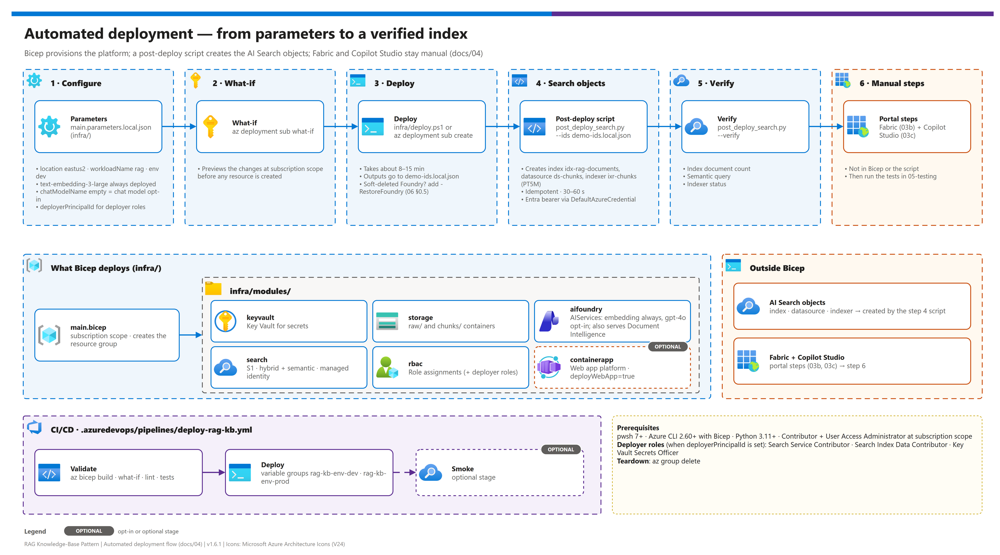

[README](../README.md) › [docs index](./00-reproduce-this-demo.md) › 04 Automated deployment

# 04 — Deployment (Automated / Bicep + scripts)

<p align="center">
  &nbsp;&nbsp;
  &nbsp;&nbsp;
  &nbsp;&nbsp;
  &nbsp;&nbsp;
  &nbsp;&nbsp;
  
</p>

 

The automated deployment path. Provisions the Azure platform layer via Bicep, then configures the AI Search index/datasource/indexer via a post-deploy Python script (because AI Search index / indexer resources are not cleanly expressible in Bicep / ARM today).

## At a glance

| | Item | Detail |
|---|---|---|
|  | **Mechanism** | `infra/deploy.ps1` / `az deployment sub create` + `scripts/post_deploy_search.py` |
|  | **Scope** | Subscription (creates the resource group) |
|  | **Runtime** | 8–15 min deploy + 30–60 s search config |
|  | **Not covered** | Fabric workspace ([03b](./03b-fabric-setup.md)) and Copilot Studio ([03c](./03c-copilot-studio-setup.md)) |

[](./assets/automated-deployment-flow.png)

<sub>Editable source: [`assets/automated-deployment-flow.drawio`](./assets/automated-deployment-flow.drawio) - regenerate with `python scripts/export_diagrams.py docs/assets`.</sub>

> [!NOTE]
> **Two paths exist; this is the automated one.** For the manual portal / CLI walkthrough, see [03-deployment-manual.md](./03-deployment-manual.md). The two paths produce the same end-state.

> [!IMPORTANT]
> **What this path DOES NOT cover.** Fabric workspace creation and Copilot Studio agent configuration are not in Bicep — they are portal-driven low-code components and each has its own dedicated runbook:
>
> - **Fabric** (workspace, identity, Lakehouse, OneLake shortcut, control table, connections, pipeline) → [03b-fabric-setup.md](./03b-fabric-setup.md)
> - **Copilot Studio** (agent, AI Search knowledge source binding, channel publishing) → [03c-copilot-studio-setup.md](./03c-copilot-studio-setup.md)
>
> Both are identical regardless of which Azure path (manual or this one) you took.

---

## What gets deployed

| | Resource | Bicep module | What it does |
|---|---|---|---|
|  | Resource group | `main.bicep` (subscription scope) | Container for everything else |
|  | Key Vault | `modules/keyvault.bicep` | RBAC-mode; for any non-managed-identity secrets |
|  | Storage account + `raw/` + `chunks/` containers | `modules/storage.bicep` | Permanent canonical store |
|  | Microsoft Foundry resource | `modules/aifoundry.bicep` | Multi-service Cognitive Services account (`kind=AIServices`). Always deploys the `text-embedding-3-large` deployment (required by the AI Search vectorizer). The `gpt-4o` chat deployment is **opt-in**: set `chatModelName` in `main.parameters.local.json` to `gpt-4o` (or `gpt-4o-mini`) to provision it; leave it empty (the default) to skip — the locked design does not consume a chat completion model. The same Foundry account also serves Document Intelligence (`prebuilt-read` OCR) — no separate FormRecognizer resource is provisioned. |
|  | AI Search Standard S1 | `modules/search.bicep` | Hybrid + semantic ranker enabled, system-assigned MI |
|  | Web app platform (**optional**) | `modules/containerapp.bicep` | Container Apps environment + ACR + Log Analytics + user-assigned managed identity for the standalone chat front end ([09](./09-foundry-agent-webapp.md)). Only when `deployWebApp=true` (default false); the image is built + deployed separately by `scripts/deploy-webapp.ps1`. |
|  | RBAC role assignments | `modules/rbac.bicep` | Search MI → `Cognitive Services OpenAI User` on Foundry; Search MI → `Storage Blob Data Reader` on Storage; Foundry MI → `Storage Blob Data Reader` on Storage (so DI can fetch `raw/<file>` via `urlSource`); when `deployerPrincipalId` is set, also grants the deployer **Search Service Contributor** + **Search Index Data Contributor** on AI Search (for `post_deploy_search.py`) **and Key Vault Secrets Officer on Key Vault** (so you can write the DI-caller SP secret in [03b § F2.2 step 3](./03b-fabric-setup.md#f22-create-a-di-caller-service-principal-for-msal-from-the-notebook) without a manual `az role assignment create`) |

**What is NOT deployed by Bicep** (configured by the post-deploy script):

- AI Search index `idx-rag-documents` (vector + hybrid + semantic configuration)
- AI Search data source `ds-chunks` (managed-identity connection to Blob)
- AI Search indexer `ixr-chunks` (with integrated AOAI vectorizer)

**What is NOT deployed by either** (manual portal steps):

- **Fabric workspace + Lakehouse + OneLake shortcut + control table + connections + Data Pipeline** — see [03b-fabric-setup.md](./03b-fabric-setup.md) (always manual)
- **Copilot Studio agent + knowledge source binding + channel publishing** — see [03c-copilot-studio-setup.md](./03c-copilot-studio-setup.md)

---

## Prerequisites

| | Requirement | Gate |
|---|---|---|
|  | All boxes in [02-prerequisites.md § Pre-flight checklist](./02-prerequisites.md#15--pre-flight-checklist) confirmed | ☐ Pre-flight complete |
|  | Local developer tooling per [02-prerequisites.md § 0](./02-prerequisites.md#0--local-developer-tooling): **PowerShell 7+ (`pwsh`)**, **Azure CLI 2.60+** with the Bicep extension (`az bicep install`), **Python 3.11+** with `pip` | ☐ Tools installed |
|  | `az login` succeeded with an identity that has **Contributor + User Access Administrator** at the **subscription** scope (the deployment targets subscription scope and creates the RG) | ☐ Roles confirmed |

> [!TIP]
> All shell snippets below are PowerShell (`pwsh`). The deployment wrapper is `infra/deploy.ps1`. See [README § Shell convention](../README.md#shell-convention) for the project-wide convention.

---

## Step 1 — Configure parameters

| Step | | Action | Gate |
|---|---|---|---|
| **1** |  | Copy `infra/main.parameters.json` to `infra/main.parameters.local.json` | ☐ Local file exists |
| **2** |  | Fill in the minimum values | ☐ `deployerPrincipalId` set |

Copy the parameter template and fill in your values:

```pwsh
cd <repo-root>
Copy-Item infra/main.parameters.json infra/main.parameters.local.json
# edit infra/main.parameters.local.json
```

Minimum values to set:

<details><summary><b>Show the minimum parameter file</b></summary>

```json
{
  "$schema": "https://schema.management.azure.com/schemas/2019-04-01/deploymentParameters.json#",
  "contentVersion": "1.0.0.0",
  "parameters": {
    "location":             { "value": "eastus2" },
    "workloadName":         { "value": "rag" },
    "env":                  { "value": "dev" },
    "embeddingModelName":   { "value": "text-embedding-3-large" },
    "embeddingModelTpm":    { "value": 10 },
    "chatModelName":        { "value": "" },
    "chatModelTpm":         { "value": 10 },
    "deployerPrincipalId":  { "value": "<output of: az ad signed-in-user show --query id -o tsv>" },
    "deployerPrincipalType":{ "value": "User" }
  }
}
```

</details>

`*.local.json` is `.gitignored` — your local parameter file with real values never ends up in the repo.

> [!WARNING]
> **`deployerPrincipalId` is important.** API keys are disabled on every Azure AI service this pattern provisions, so the post-deploy script in [Step 4](#step-4--configure-ai-search-post-deploy-script) authenticates with an Entra bearer token. Setting `deployerPrincipalId` to your object ID lets Bicep assign **Search Service Contributor** + **Search Index Data Contributor** automatically. Leave it blank if you want to assign those roles by hand (see [02-prerequisites.md § 10](./02-prerequisites.md#10--rbac-role-assignments-cheat-sheet)).
>
> For CI/CD: set `deployerPrincipalId` to the pipeline's service principal / federated workload identity object ID and `deployerPrincipalType` to `ServicePrincipal`.

---

## Step 2 — Dry-run (what-if)

| Step | | Action | Gate |
|---|---|---|---|
| **1** |  | Run `az deployment sub what-if` | ☐ Command completes |
| **2** |  | Review the planned changes | ☐ 1 RG + 6 module deployments shown |

Always run a `what-if` first to confirm what will be created:

```pwsh
az deployment sub what-if `
  --location eastus2 `
  --template-file infra/main.bicep `
  --parameters infra/main.parameters.local.json
```

Review the output. It should show: 1 RG creation + 6 module deployments (Key Vault, Storage, Foundry, model deployments, Doc Intelligence, AI Search, RBAC).

---

## Step 3 — Deploy

| Step | | Action | Gate |
|---|---|---|---|
| **1** |  | Run `infra/deploy.ps1` (or `az deployment sub create`) | ☐ Deployment succeeds (8–15 min) |
| **2** |  | Capture outputs to `demo-ids.local.json` | ☐ File written and gitignored |

Either invoke the wrapper:

```pwsh
pwsh ./infra/deploy.ps1 `
  -ParameterFile infra/main.parameters.local.json `
  -DeploymentName rag-kb-bicep-$(Get-Date -Format yyyyMMdd-HHmm)
```

Or run `az` directly:

```pwsh
az deployment sub create `
  --name rag-kb-bicep-$(Get-Date -Format yyyyMMdd-HHmm) `
  --location eastus2 `
  --template-file infra/main.bicep `
  --parameters infra/main.parameters.local.json
```

Typical runtime: **8–15 minutes** dominated by AI Search service provisioning and AOAI model deployment propagation.

After the deployment completes, capture the outputs to your local IDs file:

```pwsh
az deployment sub show `
  --name rag-kb-bicep-<your-deployment-name> `
  --query "properties.outputs.deploymentSummary.value" `
  -o json > demo-ids.local.json
```

> [!CAUTION]
> `demo-ids.local.json` is `.gitignored`. Never commit a populated `demo-ids.json`. See `demo-ids.template.json` for the schema.

---

## Step 4 — Configure AI Search (post-deploy script)

| Step | | Action | Gate |
|---|---|---|---|
| **1** |  | `pip install -r requirements.txt` in `scripts/` | ☐ Dependencies installed |
| **2** |  | Run `post_deploy_search.py --ids ../demo-ids.local.json` | ☐ Index, data source and indexer created |

Bicep deployed the AI Search **service**. The script below creates the **index** (with integrated AOAI vectorizer + semantic configuration), the **data source** (managed-identity connection to Blob), and the **indexer**.

```pwsh
cd scripts
pip install -r requirements.txt
python post_deploy_search.py --ids ../demo-ids.local.json
```

The script reads the deployment outputs from `demo-ids.local.json` and issues REST calls against the AI Search service. It is **idempotent** — safe to re-run if the first attempt fails partway. Typical runtime: **30–60 seconds**.

> **Auth model.** Admin keys are disabled on the AI Search service. The script authenticates with an Entra bearer token via `DefaultAzureCredential` — resolves to your `az login` user when run locally, or to the pipeline's workload identity in CI. The caller needs **Search Service Contributor** + **Search Index Data Contributor** on the search service. If you set `deployerPrincipalId` in [Step 1](#step-1--configure-parameters), Bicep granted these for you; otherwise assign them manually:
>
> ```pwsh
> $SRCH_RES_ID = az search service show --name <svc> -g <rg> --query id -o tsv
> $ME_OBJID    = az ad signed-in-user show --query id -o tsv
> az role assignment create --assignee-object-id $ME_OBJID --assignee-principal-type User `
>   --role "Search Service Contributor"     --scope $SRCH_RES_ID
> az role assignment create --assignee-object-id $ME_OBJID --assignee-principal-type User `
>   --role "Search Index Data Contributor" --scope $SRCH_RES_ID
> ```
>
> Wait up to **15 minutes** for the role assignment to propagate before re-running the script.

Expected output:

<details><summary><b>Show the expected script output</b></summary>

```
[OK] Index 'idx-rag-documents' created (or already exists, updated)
[OK] Data source 'ds-chunks' created (managed-identity connection to stragdeveastus2/chunks)
[OK] Indexer 'ixr-chunks' created (schedule: PT5M)
[OK] Manual indexer run triggered; status will be 'success' once the first sample chunk is in the blob container
```

</details>

---

## Step 5 — Verify

| Step | | Action | Gate |
|---|---|---|---|
| **1** |  | Run `post_deploy_search.py --verify` | ☐ Three checks report `[OK]` |

Run the smoke tests:

```pwsh
python scripts/post_deploy_search.py --ids demo-ids.local.json --verify
```

This:

1. Hits the search index `$count` endpoint — confirms the index exists and is reachable
2. Runs a semantic-typed test query — confirms the integrated vectorizer + semantic ranker fired
3. Reports indexer status — confirms the data source is wired correctly

Expected:

```
[OK] Index exists. Document count: 0  (will populate after Fabric pipeline writes chunks)
[OK] Sample query succeeded. Semantic ranker score range: empty (0 docs — re-test after first ingest)
[OK] Indexer 'ixr-chunks' status: success  (or transientFailure on first run with empty container — normal)
```

If any check fails, see [06-troubleshooting.md § 4](./06-troubleshooting.md) for the AI Search-specific diagnosis flow.

---

## Step 6 — Finish the manual steps

| | Remaining runbook | Covers | Gate |
|---|---|---|---|
|  | [03b-fabric-setup.md](./03b-fabric-setup.md) | Workspace, identity, Lakehouse, OneLake shortcut, control table, connections, ingest pipeline | ☐ Complete |
|  | [03c-copilot-studio-setup.md](./03c-copilot-studio-setup.md) | Agent creation, AI Search knowledge source, generative answers, Teams + M365 Copilot publishing | ☐ Complete |

Bicep + script have provisioned the entire Azure platform layer. Now finish:

- **Fabric setup** — [03b-fabric-setup.md](./03b-fabric-setup.md) (workspace, identity, Lakehouse, OneLake shortcut, control table, connections, ingest pipeline)
- **Copilot Studio agent** — [03c-copilot-studio-setup.md](./03c-copilot-studio-setup.md) (agent creation, AI Search knowledge source, generative answers, Teams + M365 Copilot publishing)

Once both are complete, jump to [05-testing.md](./05-testing.md).

---

## Tearing down

To remove everything Bicep created:

```pwsh
az group delete --name $(az deployment sub show --name <your-deployment> --query "properties.outputs.deploymentSummary.value.resourceGroup" -o tsv) --yes
```

Or just delete the resource group from the portal. Fabric workspace and Copilot Studio agent must be deleted separately from their respective portals.

---

## CI/CD with Azure DevOps

| Stage | | What it does |
|---|---|---|
| **Validate** |  | `az bicep build` + `az deployment sub what-if` + Python lint + tests |
| **Deploy** |  | `az deployment sub create` + `python post_deploy_search.py` + verify |
| **Smoke** (optional) |  | Sample query against the new index |

The `.azuredevops/pipelines/deploy-rag-kb.yml` pipeline implements:

1. **Validate** stage — `az bicep build` + `az deployment sub what-if` + Python lint + tests
2. **Deploy** stage — `az deployment sub create` + `python post_deploy_search.py` + verify
3. **Smoke** stage (optional) — runs a sample query against the new index

Per-environment values come from ADO **variable groups**: `rag-kb-env-dev` and `rag-kb-env-prod`. The pipeline reads from `$(Build.SourceBranchName)` to pick the correct group.

See [00-reproduce-this-demo.md § Part F](./00-reproduce-this-demo.md) for ADO wire-up.

---

## Comparison: when to use which path

| Scenario | Recommended path |
|---|---|
| First time touching this pattern | Manual ([03-deployment-manual.md](./03-deployment-manual.md)) — better learning |
| Demo / one-off lab | Manual — easier to talk through component-by-component |
| Stand up dev + prod environments | Automated — Bicep is faster + ensures parity |
| You want the IaC | Automated — the Bicep + ADO pipeline are ready to use |
| CI-driven deployments | Automated only |
| Tearing down / rebuilding repeatedly | Automated — `az group delete` + re-run |

---

Next: [05 - Testing](./05-testing.md) →

*Last updated: 2026-10-02*
