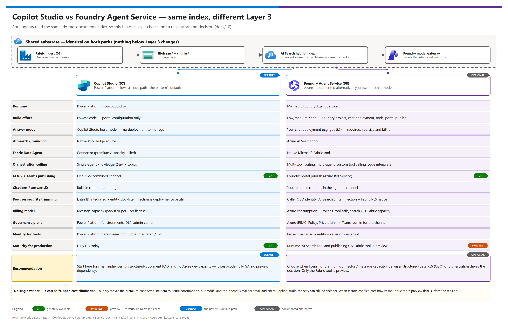

[README](../README.md) › [docs index](./00-reproduce-this-demo.md) › 10 Copilot Studio vs Foundry

# 10 — Copilot Studio vs. Microsoft Foundry Agent Service

<p>
&nbsp;
&nbsp;
&nbsp;
&nbsp;
&nbsp;

</p>

    

A decision guide for **Layer 3 (the conversational layer)** of this pattern. Both options sit on the **same ingestion + platform substrate** — the choice is purely *how users talk to the index*, and it is driven mostly by **licensing, governance model, and how much engineering you want to own.**

> **Summary.** Use **Copilot Studio** ([07](./07-copilot-studio-setup.md)) for the lowest-code, fully-GA path when the audience is small or Copilot Studio capacity is already licensed. Use **Microsoft Foundry Agent Service** ([08](./08-foundry-agent-setup.md)) when **premium-connector / message-capacity licensing is the constraint**, when you need **richer orchestration**, or when you want everything under **Azure RBAC + consumption billing** — noting that the optional **Microsoft Fabric tool is still preview** (M365/Teams publishing from Foundry is now GA).

## At a glance

| | Topic | One-line answer |
|---|---|---|
|  | **What changes** | Only Layer 3. Ingestion, Blob and the `idx-rag-documents` index are shared |
|  | **Main driver** | Licensing: premium-connector / message capacity (Copilot Studio) vs Azure consumption (Foundry) |
|  | **Default** | Copilot Studio, the lowest-code and GA path  |
|  | **Biggest Foundry caveat** | You own the chat model, tools and citation UX; the Fabric tool is  |

[](./assets/copilot-studio-vs-foundry.png)

<sub>Editable source: [`assets/copilot-studio-vs-foundry.drawio`](./assets/copilot-studio-vs-foundry.drawio) - regenerate with `python scripts/export_diagrams.py docs/assets`.</sub>

> [!IMPORTANT]
> **Status re-verified against Microsoft Learn on 2026-10-07:** Copilot Studio Teams + Microsoft 365 Copilot publishing is **GA**; [publishing a Foundry agent to Microsoft Copilot and Teams](https://learn.microsoft.com/azure/foundry/agents/how-to/publish-copilot) is **GA** (it was preview when v1.3 of this guide was written); the [Microsoft Fabric tool](https://learn.microsoft.com/azure/foundry/agents/how-to/tools/fabric) is **preview**. Re-verify before committing dates.

---

## The shared substrate (identical on both paths)

Nothing below Layer 3 changes. Both agents read the **same** `idx-rag-documents` index:

```
Fabric ingest (06)  →  Blob raw/ + chunks/  →  AI Search hybrid index
                                                 (integrated vectorizer + semantic ranker)
                                                 served by the Foundry model gateway
```

So this is **not** a re-platforming decision — you can build one, and swap to the other later without touching ingestion, storage, or the index. The migration cost is one layer, not the stack.

---

## Side-by-side

| Dimension | Copilot Studio (07) | Microsoft Foundry Agent Service (08) |
|---|---|---|
| **Runtime** | Power Platform (Copilot Studio) | Microsoft Foundry Agent Service |
| **Build effort** | Lowest-code — portal config only | Low/medium-code — Foundry project, chat deployment, tools; portal publish |
| **Answer-generation model** | Copilot Studio **host model** (no deployment to manage) | **Your** chat deployment (e.g. `gpt-5.5`) — required, you size + bill it |
| **AI Search grounding** | Native knowledge source | **Azure AI Search tool** |
| **Fabric Data Agent** | Connector (premium / capacity-billed) | Native **Microsoft Fabric tool** |
| **Orchestration ceiling** | Single-agent knowledge Q&A + topics | Multi-tool routing, multi-agent, custom tool calling, code interpreter |
| **M365 + Teams publishing** |  one-click combined channel |  Foundry portal publish (Azure Bot Service); custom engine agent optional |
| **Citations / answer UX** | Built-in citation rendering | You assemble citations in the agent + channel |
| **Per-user security trimming** | Entra ID Integrated identity; doc-filter injection deployment-specific | Caller OBO identity; AI Search `$filter` injection + **Fabric RLS native** |
| **Billing model** | Copilot Studio **message capacity** (packs) or per-user license | **Azure consumption** — tokens + tool calls + search QU + Fabric capacity |
| **Governance plane** | Power Platform (environments, DLP, admin center) | Azure (RBAC, Policy, Private Link) + Teams admin for the channel |
| **Identity for tools** | Power Platform data connection (Entra Integrated / SP) | Project **managed identity** + caller **on-behalf-of** |
| **Maturity for production** |  Fully GA today | Runtime, AI Search tool and publishing ; Fabric tool  |
| **Recommendation** |  Start here for small audiences, unstructured-document RAG, no Azure dev capacity |  Choose when licensing, per-user structured-data RLS, or orchestration drives the decision |

---

## Licensing deep-dive

This is the section that decides most deployments.

| | Cost line | Copilot Studio (07) | Foundry Agent Service (08) |
|---|---|---|---|
|  | **Agent runtime** | Message capacity (packs) or per-user Copilot Studio license, on top of M365 Copilot | Azure consumption: chat-model tokens + tool calls |
|  | **AI Search grounding** | Premium / capacity-billed connector | Native tool; search query units on your subscription |
|  | **Fabric Data Agent** | Premium / capacity-billed connector | Native Fabric tool; Fabric capacity on your subscription |
|  | **End users** | M365 Copilot license | M365 Copilot license (unchanged) |

### Why Copilot Studio surfaces a licensing wall

A Microsoft 365 Copilot license covers **declarative agents** — agents grounded on M365 content (SharePoint, Graph) built in Copilot Studio's M365 surface. The moment an agent reaches **outside** that boundary — here, an **Azure AI Search** knowledge source **and** a **Fabric Data Agent** — those become **premium / capacity-billed connectors**, and the agent is metered against **Copilot Studio message capacity** (consumption packs) or requires per-user Copilot Studio licensing **on top of** M365 Copilot. For a broad rollout, that recurring per-message/per-user cost is the limiting factor.

### Why Foundry removes it

Foundry Agent Service bills the **runtime as Azure consumption**: chat-model tokens, tool invocations, AI Search query units, and Fabric capacity — all on the **Azure subscription** you already fund. The **premium-connector licensing disappears** because the connectors become native Foundry **tools**, not Power Platform connectors. **End users still consume on their existing M365 Copilot license** (the published agent rides the M365/Teams surface). You move a Power Platform line item to Azure PAYG.

### Cost considerations and caveats

- This is a **cost shift, not a cost elimination.** Model and tool consumption is real Azure spend — quantify it before assuming savings. For **small audiences**, Copilot Studio capacity can still be cheaper than operating a Foundry agent.
- You now **own the chat model**: deployment, quota, capacity, and the answer-quality settings that Copilot Studio otherwise manages.
- **The Fabric tool is preview** — a production commitment that depends on structured-data Q&A carries preview risk.

> [!WARNING]
> **A cost shift, not a cost elimination.** Quantify Foundry model, tool, search and Fabric consumption before assuming savings, and compare against Copilot Studio capacity for your actual audience size.

---

## Copilot Studio — pros & cons

  

**Pros**
- **Lowest time-to-value** — a working grounded agent in well under an hour, no Azure agent infra.
- **Fully GA** end-to-end, including one-click **Teams + M365 Copilot** publishing.
- **No model to operate** — answers run on the managed host model; no quota/capacity work.
- **Built-in citation UX** and grounding toggles ("don't use general knowledge", "no ungrounded answers").
- **Maker-friendly** — a non-developer can own it; governed through Power Platform DLP + environments.

**Cons**
- **Premium-connector / message-capacity licensing** once you connect Azure AI Search + Fabric Data Agent — the most common constraint.
- **Orchestration ceiling** — great at knowledge Q&A, weaker at multi-tool routing / agentic actions.
- **Per-user document trimming** (group-ID filter injection) is **deployment-specific**, not guaranteed out-of-the-box.
- **Consumption is per-message** and can be hard to predict at broad-rollout scale.
- Less control over retrieval/answer internals than owning the model.

---

## Foundry Agent Service — pros & cons

  &nbsp;M365/Teams publishing:  &nbsp;Fabric tool: 

**Pros**
- **Removes the premium-connector licensing constraint** — runtime is Azure consumption; AI Search + Fabric are native tools.
- **Richer orchestration** — multi-tool routing (AI Search vs. Fabric Data Agent vs. both), multi-agent, custom tool calling, code interpreter.
- **Native Fabric Data Agent tool with on-behalf-of identity** → **per-user RLS/OLS** on structured HR data, enforced by Fabric (cleaner than the document-side filter story).
- **Unified Azure governance** — RBAC, Private Link / VNet, Policy, managed identity, no keys.
- **Strategic Microsoft direction** for pro-code agents; headroom to grow the agent beyond Q&A.
- **Predictable Azure PAYG billing** on the subscription you already run.

**Cons**
- **The Microsoft Fabric tool is preview** — the remaining production caveat when you need structured-data Q&A; re-verify before committing dates.
- **More to build & operate** — Foundry project, chat deployment + quota, tool connections, the Azure Bot Service resource behind the published agent, and caller-identity checks.
- **You own the model** — sizing, capacity, cost, answer-quality tuning.
- **Citation/answer UX is more DIY** than Copilot Studio's built-in rendering.
- **Governance is split** across Azure (runtime/tools) + Teams admin (channel) — two planes, not one.
- **Requires Azure dev skills** + consumption budget; not a non-developer maker tool.

---

## Decision matrix

| If your deployment… | Choose |
|---|---|
| Hit **premium-connector / Copilot Studio capacity licensing** as a constraint (AI Search + Fabric Data Agent) | **Foundry (08)** |
| Needs **structured-data Q&A with per-user row-level security** (HR comp, PII) | **Foundry (08)** — native Fabric RLS via OBO |
| Needs **multi-tool routing, agentic actions, or custom tool calling** | **Foundry (08)** |
| Is **Azure-committed** and wants **consumption billing + Azure RBAC/Private Link** | **Foundry (08)** |
| Needs structured-data Q&A but **cannot take a preview dependency**  (Fabric tool) | **Copilot Studio (07)**, or Foundry with the AI Search tool only |
| Is **unstructured-document RAG only**, small audience, CS capacity already licensed | **Copilot Studio (07)** |
| Has **no Azure dev capacity**, needs a **maker-owned** agent fast | **Copilot Studio (07)** |
| Needs the **lowest-effort**  Teams/M365 publish with built-in citations | **Copilot Studio (07)** |

When the column is split (e.g. licensing says Foundry but you can't take the Fabric tool's preview risk), surface the tension explicitly and weigh **cost now vs. preview risk** — don't silently pick.

---

## Migration note — you are not locked in

| | Direction | What you do | Untouched |
|---|---|---|---|
|  | **Copilot Studio → Foundry** (licensing-driven) | Deploy chat model, add AI Search tool on the same index, grant project MI **Search Index Data Reader**, add Fabric tool, publish from the Foundry portal | Index, Blob, Fabric pipeline (no re-indexing) |
|  | **Foundry → Copilot Studio** (low-code / no-Azure-dev fallback) | Bind the same index as a knowledge source, publish the combined channel | Index, Blob, Fabric pipeline |

Because Layers 1–2 are shared, moving between paths is a **Layer-3-only** effort:

- **Copilot Studio → Foundry** (the licensing-driven direction): deploy a chat model, add the AI Search tool (point at the same index), grant the project MI **Search Index Data Reader**, add the Fabric tool, publish from the Foundry portal. No re-indexing.
- **Foundry → Copilot Studio** (fall back if the team can't operate the Azure side, or the Fabric tool's preview status is a concern): bind the same index as a Copilot Studio knowledge source and publish the combined channel. The index, Blob, and Fabric pipeline are untouched.

Build the path that fits your constraints **now**; keep the other as a documented fallback.

> [!TIP]
> Because only Layer 3 differs, you can build the Copilot Studio agent first and keep the Foundry path ready as a documented licensing fallback, with no re-indexing.

---

## References

| | Resource | Link |
|---|---|---|
|  | Copilot Studio path | [07-copilot-studio-setup.md](./07-copilot-studio-setup.md) |
|  | Foundry path | [08-foundry-agent-setup.md](./08-foundry-agent-setup.md) |
|  | Architecture (Layer 3 alternatives) | [01-architecture.md](./01-architecture.md#layer-3--conversational-layer-copilot-studio--purple) |
|  | Microsoft Learn | [Copilot Studio licensing](https://learn.microsoft.com/microsoft-copilot-studio/requirements-licensing-subscriptions) · [Microsoft Foundry Agent Service overview](https://learn.microsoft.com/azure/foundry/agents/overview) |

---

Next: [11 - RBAC & identity passthrough](./11-rbac-and-identity-passthrough.md) →

*Last updated: 2026-10-07*
