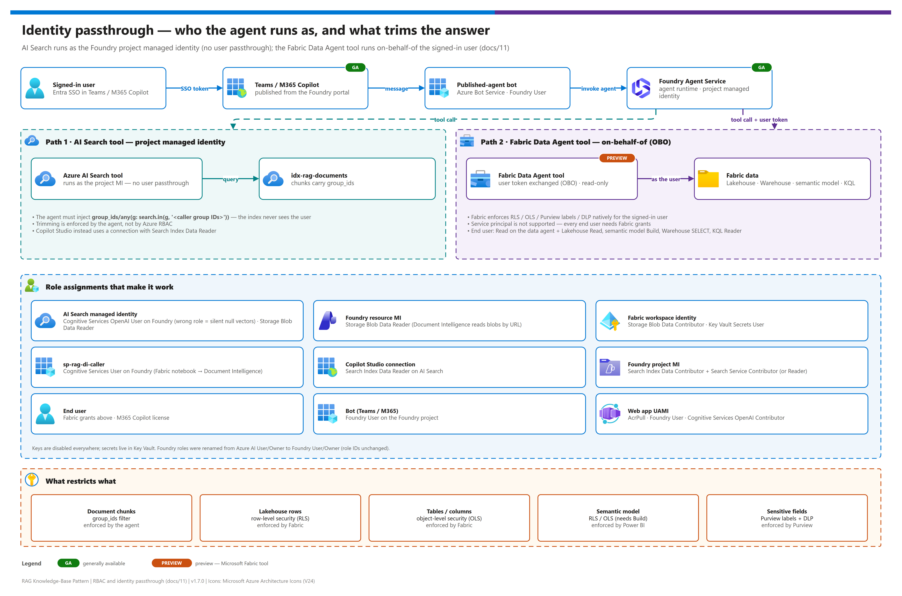

[README](../README.md) › [docs index](./00-reproduce-this-demo.md) › 11 RBAC & identity passthrough

# 11 — RBAC & identity passthrough (service configuration + per-user data restrictions)

<p>
&nbsp;
&nbsp;
&nbsp;
&nbsp;
&nbsp;

</p>

   

One place for **every identity** in the pattern, the **role** it needs, and — most importantly — **how a user's permissions flow through the agent so they only see data they're allowed to** (row-level security, object-level security, Purview/DLP, semantic-model restrictions).

> **Core principle — no keys, Entra everywhere.** Every cross-service call uses **Microsoft Entra ID** (managed identity, a connection-scoped identity, or the end user's identity). Admin/query keys and storage shared keys are **disabled**. Secrets that can't be replaced by RBAC live in **Key Vault**.

> [!WARNING]
> **Documents and structured data behave differently.** The AI Search tool runs as the **project managed identity** (no user passthrough, so you must inject a `group_ids` filter). The Fabric data agent tool runs **as the signed-in user** (OBO), so Fabric enforces RLS/OLS/Purview itself. If you do nothing on the document side, every authenticated user can retrieve every chunk.

## At a glance

| | Topic | One-line answer |
|---|---|---|
|  | **Documents (AI Search)** | Project MI queries the index; **you** inject the caller's group-ID `$filter` |
|  | **Structured data (Fabric)** | OBO user identity; Fabric enforces RLS / OLS / Purview / DLP |
|  | **Secrets** | Keys disabled; the one DI-caller secret lives in Key Vault |
|  | **Identities** | Workspace identity, three service MIs, a DI-caller SP, bot + web-app registrations, end users |

[](./assets/rbac-identity-passthrough.png)

<sub>Editable source: [`assets/rbac-identity-passthrough.drawio`](./assets/rbac-identity-passthrough.drawio) - regenerate with `python scripts/export_diagrams.py docs/assets`.</sub>

---

## The one thing to understand first: two identity modes

A Foundry agent reaches data in **two different ways**, and they enforce per-user restrictions **very differently**. This asymmetry is the single most important thing on this page.

| | **AI Search tool (documents)** | **Fabric Data Agent tool (structured)** |
|---|---|---|
| Who the query runs as | the **Foundry project's managed identity** — a single **service identity**, *not* the end user | the **signed-in end user**, via **On-Behalf-Of (OBO)** token exchange |
| Identity passthrough? | **No.** AI Search sees the project MI, not the user. | **Yes.** Fabric sees the user; service principal auth is **not supported**. |
| How per-user restriction is enforced | the agent must **inject a security filter** (the caller's Entra group IDs) — the index can't trim by a user it never sees | **Fabric enforces it natively** — RLS / OLS / Purview / DLP all apply to the user's identity automatically |
| If you do nothing | every authenticated user can retrieve **every** chunk | the user sees **only** what their Fabric permissions allow |

**In short:** structured-data restrictions (Fabric, semantic models) are **enforced for you** because the user's identity passes through. Document restrictions (AI Search) are **your responsibility to wire** because the search index is queried by a service identity, not the user. Sections [§5a](#5a-document-data-ai-search--no-passthrough-you-inject-the-filter) and [§5b](#5b-structured-data-fabric-data-agent--full-obo-passthrough) cover each.

Reference: [Agent identity (OBO vs agent identity)](https://learn.microsoft.com/azure/foundry/agents/concepts/agent-identity).

---

## Identity inventory

| Identity | Type | Used by |
|---|---|---|
| **Fabric workspace identity** | Managed identity | Ingest pipeline → Blob + Key Vault ([06](./06-fabric-setup.md)) |
| **DI-caller service principal** (`sp-rag-di-caller`) | App registration + secret in Key Vault | Fabric OCR notebook → Document Intelligence ([06 F2.2](./06-fabric-setup.md)) |
| **AI Search service MI** | System-assigned MI | Indexer → Blob; integrated vectorizer → Foundry embedding |
| **Foundry resource MI** | System-assigned MI | Document Intelligence → Blob `raw/` via `urlSource` |
| **Foundry project MI** | System-assigned MI | Foundry agent's **AI Search tool** → search index |
| **Copilot Studio data connection** | Entra ID Integrated **or** service principal | 07 agent → AI Search |
| **End user (OBO)** | Human Entra identity, passed through | Foundry agent's **Fabric tool** → Fabric data |
| **Published-agent bot** | Azure Bot Service resource (portal publish) or Entra app registration (Agents Toolkit route) | Teams/M365 → Foundry agent endpoint ([08 D6](./08-foundry-agent-setup.md)) |
| **Web app managed identity** | User-assigned MI | Standalone web app ([12](./12-foundry-agent-webapp.md)) → Foundry agent (MI mode); also the secretless OBO client-assertion source |
| **Web app OBO app registration** | Entra app registration + federated credential | Standalone web app → exchanges the user token for an Agent Service token (OBO) |
| **Builder / operator** | Human or deploy SP | Provisioning + agent authoring |

---

## Master RBAC tables

### Layer 1 — Fabric ingest (manual, [06](./06-fabric-setup.md))

| Principal | Role | Scope | Why |
|---|---|---|---|
| Fabric workspace identity | **Storage Blob Data Contributor** | Storage account | Copy/chunk activities write `raw/` + `chunks/` |
| Fabric workspace identity | **Key Vault Secrets User** | Key Vault | Read the DI-caller SP secret at notebook runtime |
| DI-caller SP (`sp-rag-di-caller`) | **Cognitive Services User** | Foundry resource | Notebook calls Document Intelligence via MSAL |

### Layer 2 — Azure platform, machine-to-machine ([rbac.bicep](../infra/modules/rbac.bicep))

| Principal | Role | Scope | Why |
|---|---|---|---|
| **AI Search service MI** | **Cognitive Services OpenAI User** | Foundry resource | Integrated vectorizer embeds chunks/queries — **critical; wrong role = silent null vectors** ([05 § 4.1](./05-troubleshooting.md)) |
| AI Search service MI | **Storage Blob Data Reader** | Storage account | Indexer pulls chunk JSON from `chunks/` |
| Foundry resource MI | **Storage Blob Data Reader** | Storage account | Document Intelligence fetches `raw/` via `urlSource` |

### Layer 3a — Copilot Studio agent ([07](./07-copilot-studio-setup.md))

| Principal | Role | Scope | Why |
|---|---|---|---|
| Copilot Studio data connection (**Entra ID Integrated** or **service principal**) | **Search Index Data Reader** | AI Search service | Agent's AI Search knowledge source queries the index (no keys) |

### Layer 3b — Foundry agent (08)

Runbook: [08](./08-foundry-agent-setup.md).

| Principal | Role | Scope | Why |
|---|---|---|---|
| **Foundry project MI** | **Search Index Data Contributor** + **Search Service Contributor** (or **Search Index Data Reader** for read-only) | AI Search service | AI Search **tool** queries the index |
| Foundry project MI / caller | **Cognitive Services OpenAI User** | Foundry resource | Agent generates answers on the chat deployment |
| **End user (OBO)** | **Read** on the Fabric data agent + each source (Lakehouse Read; **semantic model Build**; Warehouse SELECT; KQL Reader) | Fabric workspace | Fabric **tool** answers within the user's RLS/OLS scope — **user identity only** |
| Publisher / published-agent bot | **Azure Bot Service Contributor** on the RG to publish; **Foundry User** (or toolkit-configured connection) on the project | Resource group / Foundry project | Bot forwards Teams / M365 turns to the agent endpoint |
| End users | **Microsoft 365 Copilot** license | M365 tenant | Consume the agent in Teams / M365 Copilot |

> [!NOTE]
> **Foundry RBAC role rename:** **Foundry User / Foundry Owner / Foundry Account Owner / Foundry Project Manager** were formerly *Azure AI User / Owner / Account Owner / Project Manager*. Role IDs and permissions are unchanged.

### Builder / operator (assigned once per environment, [02 § 10](./02-prerequisites.md#10--rbac-role-assignments-cheat-sheet))

| Principal | Role | Scope |
|---|---|---|
| Building user / deploy SP | **Search Service Contributor** + **Search Index Data Contributor** | AI Search service |
| Building user | **Storage Blob Data Contributor** | Storage account |
| Building user | **Cognitive Services Contributor** | Foundry resource |
| Building user | **Key Vault Secrets Officer** | Key Vault |
| Fabric Data Agent builder | **Member** / **Contributor** | Fabric workspace |
| Foundry agent builder | **Foundry User** (or **Foundry Project Manager**) | Foundry project |

---

## How per-user restrictions are enforced (the passthrough deep-dive)

```
        Teams / M365 Copilot user
                  │  (user signs in; SSO)
                  ▼
   Teams / M365 channel (bot)  ──passes user token──►  Foundry Agent Service
                  │                                          │
                  │                          ┌───────────────┴───────────────┐
                  │                          ▼                               ▼
                  │              AI Search tool                    Fabric Data Agent tool
                  │       runs as PROJECT MANAGED IDENTITY      runs ON-BEHALF-OF the USER
                  │                          │                               │
                  │            (no user identity reaches          (user token exchanged;
                  │             the index — you must inject         Fabric enforces RLS/OLS/
                  │             a group-ID security filter)         Purview/DLP for that user)
                  ▼                          ▼                               ▼
            grounded answer            idx-rag-documents              Lakehouse / Warehouse /
                                                                      semantic model / KQL
```

### 5a. Document data (AI Search) — **no passthrough**, you inject the filter

The AI Search tool is queried by the **project managed identity**, so the index never sees the end user. Per-document (per-chunk) restriction is therefore **filter-based**, and the agent must supply the filter:

1. Each chunk carries a filterable `group_ids` field (the Entra group object IDs allowed to see it), populated at chunk creation ([01 § Document-level access control](./01-architecture.md#document-level-chunk-level-access-control), [06](./06-fabric-setup.md)). `[]` = visible to all.
2. At query time the agent injects an OData filter built from the **caller's** group memberships:
   `group_ids/any(g: search.in(g, '<caller group IDs>'))`
3. Mapping the signed-in user → their group IDs → the `$filter` is **deployment-specific wiring** (the Teams / M365 Copilot channel provides the caller identity). Validate it with two users ([04 § G](./04-testing.md)).

> **If you skip this, every authenticated user can retrieve every chunk.** GA **security filters** are the baseline; **Purview sensitivity labels**, ADLS/Blob **ACL/RBAC scopes**, and **SharePoint ACLs** are preview alternatives that enforce from the user token instead — see [Azure AI Search document-level access](https://learn.microsoft.com/azure/search/search-document-level-access-overview).

### 5b. Structured data (Fabric Data Agent) — **full OBO passthrough**

The Fabric tool runs queries **as the signed-in user** (OBO). Fabric enforces every restriction natively — you don't inject anything:

| Restriction | How it works under OBO |
|---|---|
| **Workspace / item permissions** | The user must have **Read** on the data agent and each source; otherwise the tool call fails for that user. |
| **Row-level security (RLS)** | RLS roles on a Lakehouse/Warehouse/semantic model filter **rows** to what the user's role allows. Queries run as the user, so RLS applies automatically. |
| **Object-level security (OLS)** | OLS hides **tables/columns** from unauthorized users; the agent can't surface what the user can't see. |
| **Purview sensitivity labels + DLP** | The data agent **respects Microsoft Purview** governance on the sources — DLP policies (GA for Warehouse) can detect/restrict sensitive data; labels and access-restriction policies can block specific queries or fields. |
| **Read-only** | The data agent maintains **read-only** connections — it can never write, regardless of the user's write rights. |
| **Least-privilege + scope guardrails** | It uses the user's credentials for schema discovery and constrains tool outputs to the **scoped data sources** only. |
| **Risk controls**  | Optional **Azure AI Content Safety**; Purview **DSPM Data Risk Assessments**, risk discovery/auditing, and **Insider Risk Management** can monitor agent prompts/responses. |

Because identity passes through, **a user who is restricted from certain rows, columns, or a whole table in Fabric is automatically restricted in the agent's answers** — no extra agent configuration. Reference: [Fabric Data Agent concept § security](https://learn.microsoft.com/fabric/data-science/concept-data-agent) · [end-to-end (incl. security)](https://learn.microsoft.com/fabric/data-science/data-agent-end-to-end-tutorial).

### 5c. Power BI semantic models (a source the Fabric Data Agent can use)

If the Fabric Data Agent points at a **Power BI semantic model** (instead of, or alongside, the Lakehouse tables in this sample):

- **RLS** roles defined in the model filter rows to the querying user's role membership; **OLS** hides tables/columns. Under OBO these apply to the **end user**, not the agent.
- **Permission nuance:** the Foundry Fabric tool prerequisites require **Build** on the semantic model (Read alone is insufficient to generate model queries); RLS/OLS still constrain what that Build user actually sees. Reference: [Power BI RLS](https://learn.microsoft.com/fabric/security/service-admin-row-level-security) · [OLS](https://learn.microsoft.com/fabric/security/service-admin-object-level-security).

### Restriction matrix (at a glance)

| Data | Restriction mechanism | Enforced by | Reaches the user via |
|---|---|---|---|
| Document chunks | `group_ids` security filter  | the **agent** (filter injection) | project MI **+** injected caller group IDs |
| Lakehouse / Warehouse rows | RLS | **Fabric** | OBO user identity |
| Tables / columns | OLS | **Fabric / Power BI** | OBO user identity |
| Semantic-model rows/objects | RLS / OLS | **Power BI** | OBO user identity (Build to query) |
| Sensitive fields, policies | Purview labels + DLP | **Purview / Fabric** | OBO user identity |

---

## Service principal vs OBO — what you trade

| | **OBO (user identity)** | **Service / fixed identity** |
|---|---|---|
| Per-user RLS/OLS/Purview | **Enforced automatically** | **Lost** — everyone sees the one identity's scope |
| AI Search tool | n/a (always project MI) | uses project MI (this is the only mode) |
| Fabric tool | **Required / only supported mode** | **Not supported** |
| Copilot Studio (07) | Entra ID Integrated = per-user identity | Service principal = one identity for all |

**Guideline:** for any data with per-user sensitivity (comp, PII, manager-only views), use **OBO** so Fabric enforces restrictions, and wire the **AI Search `group_ids` filter** so the document side matches. A fixed/service identity is acceptable only for uniformly-shareable, non-sensitive data.

---

## Configuration checklist — are the services configured?

> [!TIP]
> Work top to bottom: platform and ingest roles first, then the agent path you chose, then the two-user checks. RBAC changes can take up to 15 minutes to propagate ([05 § 1.1](./05-troubleshooting.md#11-rbac-propagation-lag)).

**Platform (machine-to-machine)**
- [ ] AI Search MI has **Cognitive Services OpenAI User** on Foundry (not plain *Cognitive Services User* — silent-failure trap) and **Storage Blob Data Reader** on Storage.
- [ ] Foundry resource MI has **Storage Blob Data Reader** on Storage.
- [ ] Local auth / shared keys **disabled** on AI Search, Foundry, and Storage; secrets only in Key Vault.

**Fabric ingest**
- [ ] Workspace identity has **Storage Blob Data Contributor** + **Key Vault Secrets User**; DI-caller SP has **Cognitive Services User** on Foundry.

**Agent — Copilot Studio (07)**
- [ ] Data connection uses **Entra ID Integrated** (per-user) or **service principal** (never Access Key); identity has **Search Index Data Reader**.

**Agent — Foundry (08)**
- [ ] Project MI has the AI Search tool roles (**Search Index Data Contributor + Search Service Contributor**, or **Reader** for read-only) and **Cognitive Services OpenAI User** on Foundry.
- [ ] Fabric tool connection uses **OBO (user identity)**; each end user has **Read** on the data agent + sources (Lakehouse Read / semantic model Build / Warehouse SELECT / KQL Reader).
- [ ] Bot/builder hold **Foundry User** (or Project Manager); end users hold **M365 Copilot** licenses.

**Per-user restrictions**
- [ ] Document side: `group_ids` populated at chunk creation **and** the caller's group-ID `$filter` is injected at query time (validated with two users, [04 § G](./04-testing.md)).
- [ ] Structured side: RLS/OLS defined on Lakehouse/Warehouse/semantic model; Purview labels/DLP applied; verified by querying as two users with different scopes.

---

## Common misconfigurations (silent-failure traps)

| Symptom | Cause | Fix |
|---|---|---|
| Indexer succeeds but `vectorIndexSize: 0` | AI Search MI has *Cognitive Services User* instead of **OpenAI User** | Correct the role, reset + rerun the indexer ([05 § 4.1](./05-troubleshooting.md)) |
| Every user sees every document | No `group_ids` filter injected (AI Search has no user identity) | Wire the caller-group `$filter` ([§5a](#5a-document-data-ai-search--no-passthrough-you-inject-the-filter)) |
| Users see structured data they shouldn't | Fabric tool wired with a **service/fixed identity**, or RLS not defined | Use **OBO**; define RLS/OLS on the source |
| Fabric tool call fails for some users | End user lacks **Read** on the data agent or a source | Grant per-source minimum permission ([§Layer 3b](#layer-3b--foundry-agent-08)) |
| Fabric tool rejects a service principal | SP auth isn't supported by the Fabric tool | Use user identity (OBO) only |

---

## References

> [!NOTE]
> Role names and preview surfaces change. Re-verify the Foundry, Fabric and AI Search role names against the Microsoft Learn pages below at deploy time.

- [Agent identity (OBO vs agent identity)](https://learn.microsoft.com/azure/foundry/agents/concepts/agent-identity) · [RBAC in Microsoft Foundry](https://learn.microsoft.com/azure/foundry/concepts/rbac-foundry)
- [Azure AI Search document-level access](https://learn.microsoft.com/azure/search/search-document-level-access-overview)
- [Fabric Data Agent — concept (security)](https://learn.microsoft.com/fabric/data-science/concept-data-agent) · [end-to-end](https://learn.microsoft.com/fabric/data-science/data-agent-end-to-end-tutorial)
- [Fabric / Power BI row-level security](https://learn.microsoft.com/fabric/security/service-admin-row-level-security) · [object-level security](https://learn.microsoft.com/fabric/security/service-admin-object-level-security)
- Layer detail: [01 § Trust boundaries](./01-architecture.md#trust-boundaries--security) · [02 § 10 RBAC cheat sheet](./02-prerequisites.md#10--rbac-role-assignments-cheat-sheet) · [08 RBAC summary](./08-foundry-agent-setup.md#rbac-summary--high-level) · [09 Identity & RBAC](./09-fabric-data-agent.md#identity--rbac-how-this-ties-to-08)

---

Next: [12 - Foundry agent web app](./12-foundry-agent-webapp.md) →

*Last updated: 2026-10-07*
